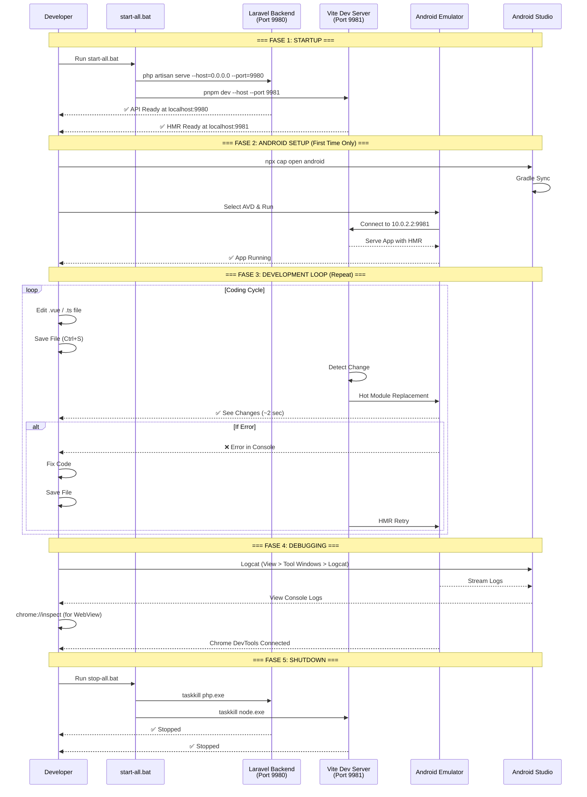

# Cerdas Development Lifecycle

> **Last Updated**: 2026-01-14
> **Purpose**: Dokumentasi lengkap tentang feedback loop pengembangan aplikasi Cerdas

## Overview

Dokumen ini menjelaskan seluruh alur pengembangan (development lifecycle) untuk project Cerdas, termasuk cara start/stop server, coding, debugging, dan testing.

---

## Quick Reference

| Aksi | Command | Port |
|------|---------|------|
| Start All Servers | `start-all.bat` | Backend:9980, Client:9981, Editor:9982 |
| Stop All Servers | `stop-all.bat` | - |
| Open Android Studio | `npx cap open android` | - |
| Sync Android | `npx cap sync android` | - |
| Build Client | `pnpm build` (di apps/client) | - |

---

## Sequence Diagram: Development Feedback Loop



---

## Fase 1: Startup

### 1.1 Start All Servers

```batch
# Dari root project
c:\projects\cerdas\start-all.bat
```

**Output yang diharapkan:**
```
========================================
  CERDAS - Starting All Applications
========================================

Starting Backend API on port 9980...
Starting Client App on port 9981...
Starting Editor App on port 9982...

========================================
  All apps starting...

  Backend API:  http://localhost:9980
  Client App:   http://localhost:9981
  Editor App:   http://localhost:9982
========================================
```

### 1.2 Verifikasi Server

| Server | URL Test | Expected |
|--------|----------|----------|
| Backend | http://localhost:9980/api/user | JSON response atau 401 |
| Client | http://localhost:9981 | Login page |
| Editor | http://localhost:9982 | Editor page |

---

## Fase 2: Android Setup (First Time)

### 2.1 Prerequisites

- [x] Android Studio installed
- [x] AVD created (API 29+ / Android 10+)
- [x] Java/JDK configured

### 2.2 Open Android Studio

```bash
cd apps/client
npx cap open android
```

### 2.3 Run on Emulator

1. Tunggu **Gradle Sync** selesai (progress bar hilang)
2. Pilih AVD di dropdown atas
3. Klik **Run** (▶️)
4. Tunggu app terinstall (~30 detik pertama kali)

### 2.4 Verifikasi Koneksi

App di emulator harus:
- Menampilkan UI (bukan blank)
- Console log: `"Using LocalStorage Adapter"` atau database success

---

## Fase 3: Development Loop (Main Cycle)

### 3.1 Alur Kerja Harian

```
┌─────────────────────────────────────────────────────────────┐
│                                                             │
│    ┌──────────┐                                             │
│    │  START   │                                             │
│    └────┬─────┘                                             │
│         │                                                   │
│         ▼                                                   │
│    ┌──────────┐     ┌──────────┐     ┌──────────┐          │
│    │  Edit    │────▶│  Save    │────▶│   HMR    │          │
│    │  Code    │     │ (Ctrl+S) │     │ (2 sec)  │          │
│    └──────────┘     └──────────┘     └────┬─────┘          │
│         ▲                                  │                │
│         │                                  ▼                │
│         │           ┌──────────┐     ┌──────────┐          │
│         │           │   Fix    │◀────│  Check   │          │
│         │           │  Error   │     │  Result  │          │
│         │           └────┬─────┘     └────┬─────┘          │
│         │                │                │                 │
│         │                ▼                ▼                 │
│         │           ┌─────────────────────────┐            │
│         └───────────│    Continue Coding      │            │
│                     └─────────────────────────┘            │
│                                                             │
└─────────────────────────────────────────────────────────────┘
```

### 3.2 Files yang Trigger HMR

| Directory | File Types | HMR Speed |
|-----------|------------|-----------|
| `apps/client/src/` | `.vue`, `.ts`, `.css` | ~1-2 sec |
| `packages/form-engine/src/` | `.vue`, `.ts` | ~2-3 sec |
| `apps/client/public/` | Static assets | Full reload |

### 3.3 Files yang Perlu Rebuild

| Action | When |
|--------|------|
| `pnpm build` + `npx cap sync` | Ubah `capacitor.config.ts` |
| Restart Android app | Ubah native code (Java/Kotlin) |
| `npx cap sync` | Ubah assets di `public/` |

---

## Fase 4: Debugging

### 4.1 Android Logcat (Native Logs)

Di Android Studio:
1. View → Tool Windows → Logcat
2. Filter: `package:com.cerdas.client`
3. Lihat error Java/Kotlin/SQLite

### 4.2 Chrome DevTools (WebView Logs)

1. Buka Chrome di PC
2. Navigate ke: `chrome://inspect/#devices`
3. Cari device/emulator Anda
4. Klik **Inspect** pada WebView

### 4.3 Common Errors & Solutions

| Error | Cause | Solution |
|-------|-------|----------|
| `net::ERR_CONNECTION_REFUSED` | Backend not running | Run `start-all.bat` |
| `database not opened` | SQLite init failed (web) | Use Android emulator instead |
| `Cannot read property of undefined` | Data not loaded | Check API response |
| `CORS error` | Backend tidak allow origin | Check Laravel CORS config |


## Fase 5: Verification & Push

Sebelum melakukan `git push`, **WAJIB** menjalankan script verifikasi lokal untuk memastikan code quality dan build integrity.

### 5.1 Run Verification Script

```powershell
# Windows
./verify-local.ps1
```

```bash
# Linux / Mac
./verify-local.sh
```

Script ini akan melakukan:
1.  **Linting**: ESLint untuk detecting code errors & stylic issues.
2.  **Type Checking**: `vue-tsc` untuk TypeScript error check.
3.  **Build**: `vite build` untuk memastikan production build sukses.

### 5.2 Push to GitHub

Jika verifikasi sukses (All Checks Passed):

```bash
git push origin main
```

> **Note:** GitHub Actions juga akan menjalankan check yang sama, tapi verifikasi lokal menghemat waktu dengan mendeteksi error lebih awal.

---

## Fase 6: Shutdown

### 5.1 Stop All Servers

```batch
c:\projects\cerdas\stop-all.bat
```

### 5.2 Manual Cleanup (if needed)

```powershell
# Kill all PHP processes
taskkill /F /IM php.exe

# Kill all Node processes
taskkill /F /IM node.exe
```

---

## Environment Configuration

### Development (Live Reload)

**`apps/client/capacitor.config.ts`:**
```typescript
const useLiveReload = true;  // ← Set to true
```

**`apps/client/.env.local`:**
```
VITE_API_URL=http://10.0.2.2:9980/api
```

### Production Build

**`apps/client/capacitor.config.ts`:**
```typescript
const useLiveReload = false;  // ← Set to false
```

**`apps/client/.env.production`:**
```
VITE_API_URL=https://your-production-api.com/api
```

---

## Network Topology

```
┌─────────────────────────────────────────────────────────────┐
│                     YOUR PC (Host)                          │
│                                                             │
│   ┌─────────────────┐        ┌─────────────────┐            │
│   │  Laravel        │        │  Vite           │            │
│   │  Backend        │        │  Dev Server     │            │
│   │                 │        │                 │            │
│   │  0.0.0.0:9980   │        │  0.0.0.0:9981   │            │
│   └────────┬────────┘        └────────┬────────┘            │
│            │                          │                     │
│   ─────────┴──────────────────────────┴──────────           │
│                    Virtual Network                          │
│   ───────────────────────┬──────────────────────            │
│                          │                                  │
│   ┌──────────────────────▼──────────────────────┐           │
│   │          ANDROID EMULATOR                    │           │
│   │                                              │           │
│   │   10.0.2.2:9980 ─────▶ Host Backend          │           │
│   │   10.0.2.2:9981 ─────▶ Host Vite             │           │
│   │                                              │           │
│   │   ┌─────────────────────────────────┐        │           │
│   │   │       CERDAS CLIENT APP         │        │           │
│   │   │                                 │        │           │
│   │   │   WebView ◀──── HMR ◀──── Vite  │        │           │
│   │   │                                 │        │           │
│   │   │   SQLite ◀────── Native Driver  │        │           │
│   │   └─────────────────────────────────┘        │           │
│   └──────────────────────────────────────────────┘           │
└─────────────────────────────────────────────────────────────┘
```

---

## Checklist: New Coding Session

Gunakan checklist ini setiap mulai session coding baru:

- [ ] Run `start-all.bat`
- [ ] Verify Backend: `curl http://localhost:9980/api/user`
- [ ] Verify Client: Open `http://localhost:9981` in browser
- [ ] Open Android Studio: `npx cap open android`
- [ ] Run app on emulator
- [ ] Verify HMR: Edit a file, see change in emulator
- [ ] Start coding! 🎉

---

## Changelog

| Date | Change |
|------|--------|
| 2026-01-14 | Initial creation with full lifecycle documentation |
