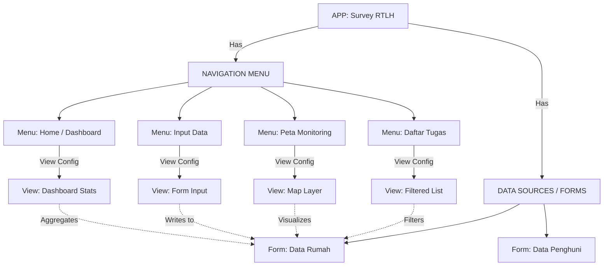
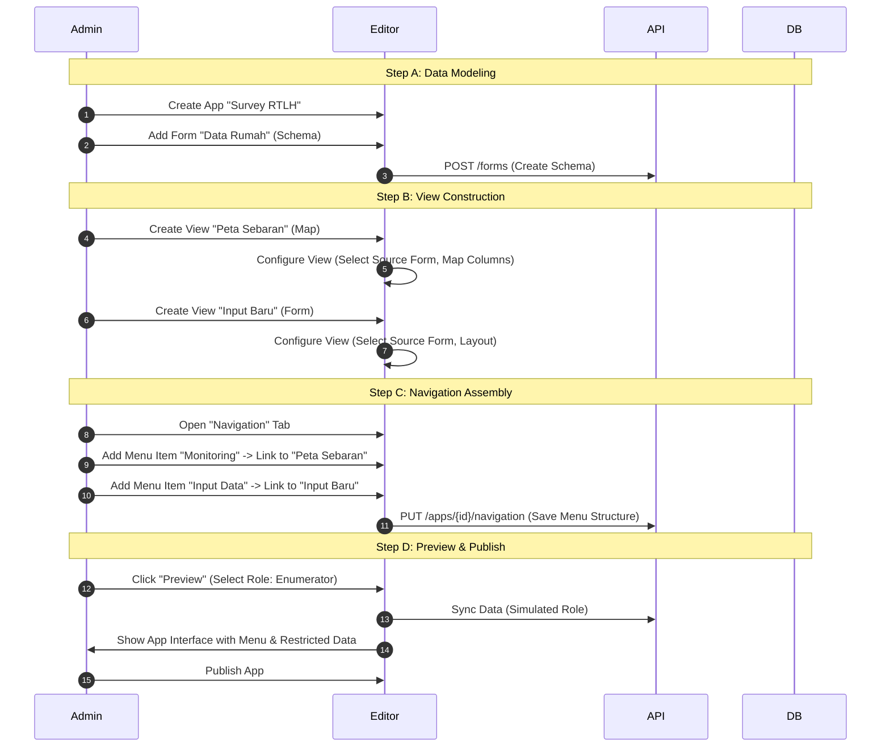

# App Editor & Workflow Architecture

> Blueprint arsitektur dan alur kerja untuk "Cerdas App Editor". Dokumen ini menjelaskan hubungan antara App, Form (Data), dan Views (Presentasi), serta alur kerja Role & Permission.

## 1. Core Philosophy: Data vs View Separation

Arsitektur Cerdas mengadopsi prinsip **"One Form, Multiple Views"**:

*   **App (Container):** Wadah proyek yang menampung Forms, Views, dan Users.
*   **Form (Data Source/Schema):** Definisi struktur data, tipe, dan validasi. ("Database Desain").
*   **View (Presentation):** Cara data ditampilkan kepada user. Satu Form bisa memiliki banyak View (misal: "Map View", "List View", "Dashboard").
*   **Menu (Navigation):** Struktur navigasi yang menghubungkan item menu ke View tertentu.

### Conceptual Model


---

## 2. Roles & Permissions

Definisi aktor yang terlibat dalam ekosistem Cerdas:

| Role | Scope | Deskripsi |
|------|-------|-----------|
| **Super Admin** | Global | "Role Tuhan". Akses penuh ke semua App, Org, dan Data. Bisa assign App ke Organization. |
| **App Creator** | App Level | Pembuat App. Mendesain Form, mengatur Menu/Views, dan membagikan akses App. |
| **App Admin** | Org Level | Member organisasi yang mengelola operasional App (Assign tugas, Manajemen User Org). |
| **User (Enumerator)** | Row Level | Pengumpul data. Hanya bisa melihat/mengedit data (assignment) miliknya sendiri. |
| **User (Supervisor)** | Group Level | Verifikator. Bisa melihat data enumerator di bawah supervisinya. |

---

## 3. Editor Workflow

Alur kerja pembuatan aplikasi tidak lagi sekadar "Membuat Form", tetapi "Membangun App Solution".

### FASE 1: App Setup & Data Modeling (Forms)
1.  **Create App:** Admin membuat App baru (misal: "Survey RTLH 2026").
2.  **Define Forms (Data Sources):** Admin mendesain struktur tabel/schema.
    *   *Create Form "Rumah":* Add fields (Nama, Alamat, Foto, GPS).
    *   *Create Form "Penghuni":* Add fields (NIK, Nama, Usia).
3.  **Set Rules:** Validasi, Formula, dan Logic antar field.

### FASE 2: View & Navigation Configuration
1.  **Design Views:** Admin membuat View untuk berinteraksi dengan data Form.
    *   *View "Input Rumah":* Tipe Form View, Source: Form Rumah.
    *   *View "Monitoring Peta":* Tipe Map View, Source: Form Rumah, GroupBy: Kecamatan.
    *   *View "Tugas Saya":* Tipe Deck View, Source: Form Rumah, Filter: `Status != Completed`.
2.  **Configure Menu:** Admin menyusun menu aplikasi.
    *   Drag & drop Views ke dalam struktur Menu.
    *   Menambahkan icon dan label untuk setiap item menu.

### FASE 3: Role & Data Strategies Strategy
1.  **Preview As Role:** Admin melakukan simulasi di Editor.
    *   *Preview as Enumerator:* Memastikan user hanya melihat menu "Input" dan list tugasnya sendiri.
    *   *Preview as Supervisor:* Memastikan user melihat menu "Monitoring" dan semua data.
2.  **Publish:** Menyimpan versi App (Snapshot Schema & View Config).

### Sequence Diagram: App Creation Flow


---

## 4. App Editor UI Structure

Struktur Editor dirombak untuk mendukung konsep App-Centric.

```
┌───────────────────────────────────────────────────────────────┐
│  App Editor : Survey RTLH                           [Publish] │
├───┬───────────────────────────────────────────────────────────┤
│ M │  ┌──────────────────────┐  ┌───────────────────────────┐  │
│ E │  │  Data Sources (Forms)│  │  Canvas / Configuration   │  │
│ N │  │  📄 Data Rumah       │  │                           │  │
│ U │  │  📄 Data Penghuni    │  │  [ Tab: Fields (Schema) ] │  │
│   │  │  [+ New Form]        │  │  [ Tab: Views (Layouts) ] │  │
│ B │  │                      │  │  [ Tab: Settings ]        │  │
│ A │  └──────────────────────┘  │                           │  │
│ R │                            │  (Context depend on       │  │
│   │  ┌──────────────────────┐  │   selection on left)      │  │
│   │  │  Navigation (App)    │  │                           │  │
│   │  │  ☰ Home (Dashboard)  │  │                           │  │
│   │  │  ☰ Input (View 1)    │  │                           │  │
│   │  │  ☰ Map (View 2)      │  │                           │  │
│   │  └──────────────────────┘  │                           │  │
└───┴───────────────────────────────────────────────────────────┘
```

*   **Left Panel:** Pohon struktur App (Forms & Menu Items).
*   **Main Canvas:** Area kerja konteks.
    *   Jika klik **Form**, kanvas menampilkan **Field Editor** (Schema).
    *   Jika klik **Menu Item/View**, kanvas menampilkan **View Configurator** (Layout, Filter, Display).

---

## 5. Implementation Roadmap (Revisi)

Prioritas pengembangan untuk mencapai arsitektur ini:

### Phase 1: Separation Logic (Backend & Core) ✅
- [x] Rename `project` -> `app`, `schema` -> `form`.
- [x] Pindahkan `layout` config dari tight coupling schema (siapkan field terpisah).
- [ ] Implementasi tabel/json structure untuk `app_navigation` dan `views`.

### Phase 2: Navigation & Multi-View (Frontend) 🚧
- [x] **AppShell Side Menu:** Implementasi dasar menu perpindahan form (Done).
- [ ] **Configurable Navigation API:** Endpoint untuk menyimpan struktur menu custom per App.
- [ ] **View configuration UI:** UI untuk membuat slice/view berbeda dari satu form.

### Phase 3: Advanced Role & Simulation
- [ ] **Preview As Role:** Selector di Editor untuk simulasi.
- [ ] **Role-based Menu Visibility:** Logic "Show menu item IF user is Supervisor".

---

## 6. Technical Notes: Data - View Mapping

Untuk mewujudkan "One Form, Multiple Views", struktur JSON `layout` saat ini perlu di-extend atau dipecah.

**Current (Form-Bound Layout):**
`form_versions.layout` mengontrol tampilan form tersebut.

**Proposed (App-Bound Views):**
Sebuah `App` memiliki properti `views` list.
```json
// app.views (JSON)
{
  "view_map_01": {
    "type": "map",
    "source_form_id": "uuid-form-1",
    "label": "Peta Sebaran",
    "config": { "lat": "lat_col", "long": "long_col" }
  },
  "view_list_pending": {
    "type": "deck",
    "source_form_id": "uuid-form-1",
    "label": "Tugas Pending",
    "filter": "status != 'completed'"
  }
}
```

**Proposed (App Navigation):**
```json
// app.navigation (JSON)
[
  { "id": "nav_1", "type": "view", "view_id": "view_list_pending", "icon": "list" },
  { "id": "nav_2", "type": "view", "view_id": "view_map_01", "icon": "map" }
]
```
