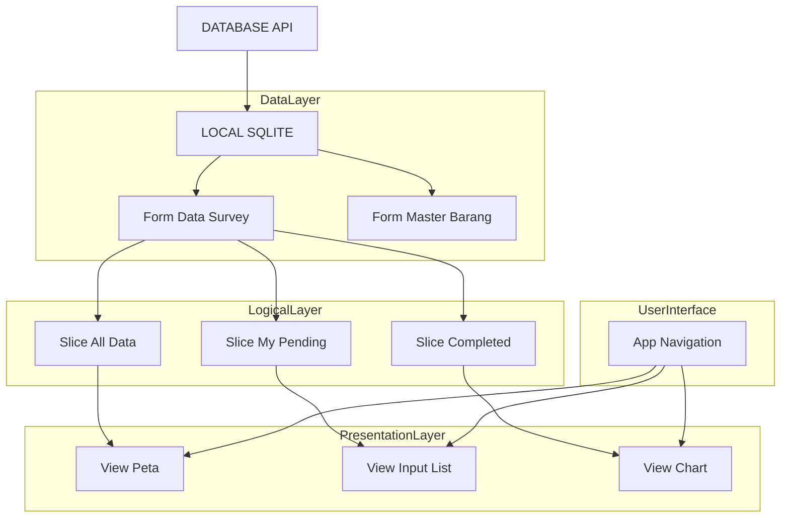
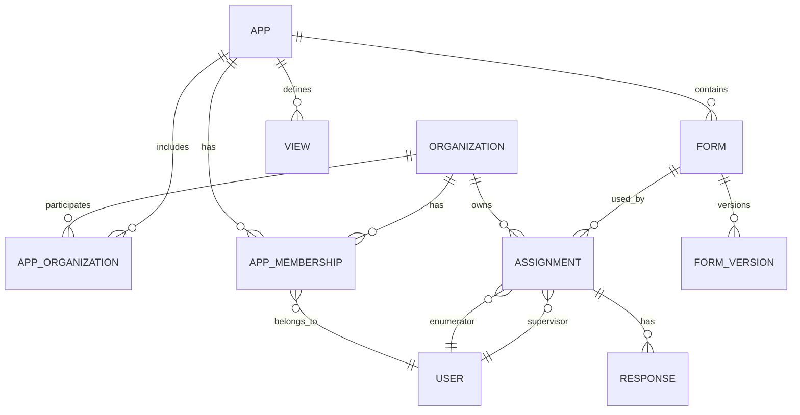
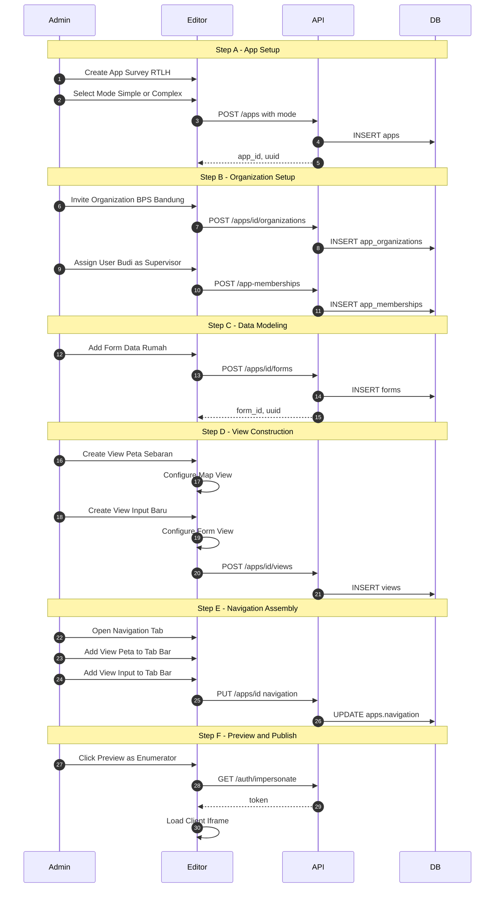
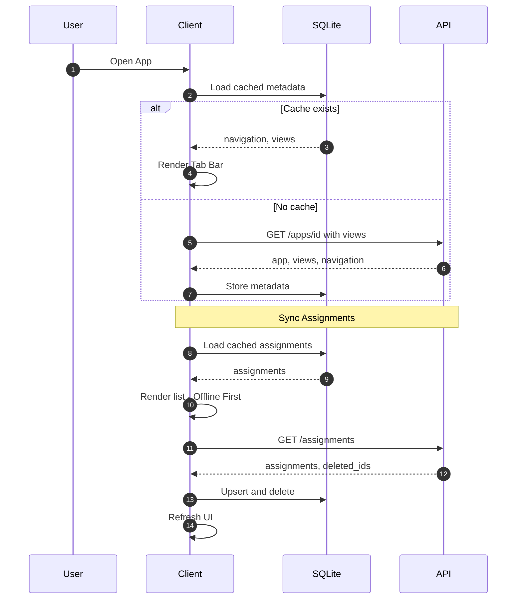
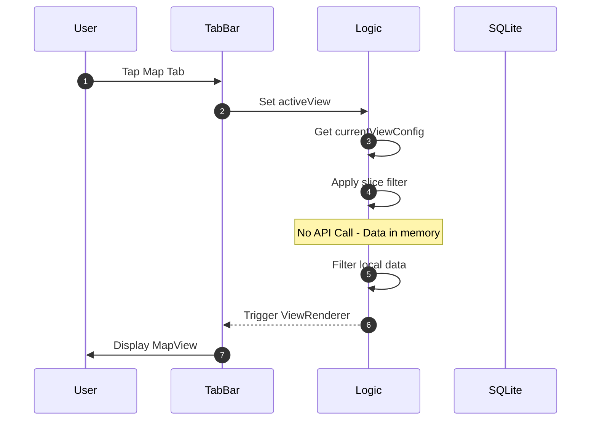
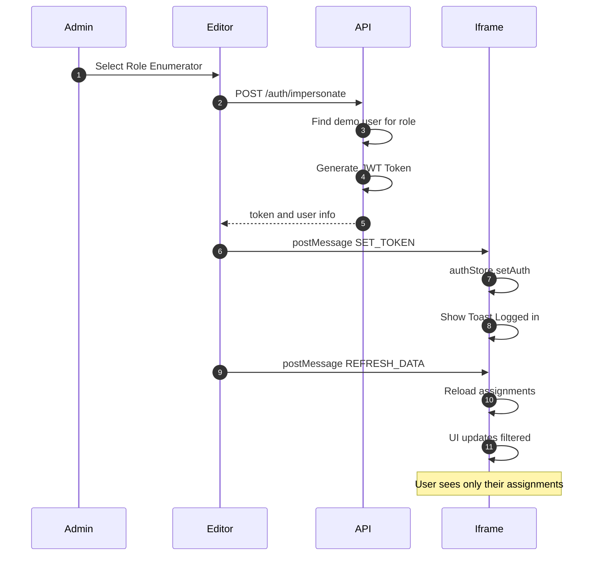

# App Editor & Workflow Architecture

> Blueprint arsitektur dan alur kerja untuk "Cerdas App Editor". Dokumen ini menjelaskan hubungan antara App, Data Sources (Forms), Slices, Views, dan Navigation, mengadopsi prinsip fleksibel ala AppSheet.

## 1. Core Philosophy: The Layered Architecture

Arsitektur Cerdas didesain modular untuk memisahkan **Data**, **Logic**, dan **Presentation**:

1.  **Data Sources (Physical Tables):** Database fisik atau tabel asli (Assignments, Users, Places). Ini adalah "Single Source of Truth".
2.  **Forms / Virtual Tables (Schema):** Definisi struktur data di dalam App. Satu App bisa terhubung ke banyak Form.
3.  **Slices (Virtual Subsets):** Lapisan logika untuk memfilter data tanpa mengubah data asli. (Misal: "Assignments Saya", "Assignments Pending").
4.  **Views (Presentation):** Komponen UI yang menempel pada Slice/Form (Map, Table, Deck, Chart).
5.  **App Navigation (Menu):** Pintu masuk user untuk mengakses Views.

### Conceptual Model


---

## 2. Roles & Context

Peran user menentukan Slice mana yang mereka lihat (Row Level Security & Role Based Views):

| Role | Scope | Deskripsi |
|------|-------|-----------|
| **Super Admin** | System | Manage seluruh Organisasi dan Server. ("Tuhan") |
| **App Creator** | App | Desainer App. Mengatur Schema, Slices, Views, dan Navigasi. |
| **App Admin** | Org | Operator App. Manage user di lapangan. |
| **Supervisor** | Group | Melihat data semua enumerator dalam grupnya. Menggunakan Slice tanpa filter user. |
| **Enumerator** | Self | Pengumpul data. Menggunakan Slice dengan filter `user_id = me`. |

### 2.1 Organization Lifecycle

**Organization** adalah entitas **GLOBAL** yang independen. Satu Organization bisa berpartisipasi di banyak App, dan satu App bisa memiliki banyak Organization. Hanya **Super Admin** yang bisa membuat Organization.

**App Modes:**

| Mode | Deskripsi |
|------|-----------|
| **Simple** | Membership langsung di level App. 1 Default Organization otomatis dibuat. |
| **Complex** | Membership di level Organization. Multiple Organizations per App. |

**Contoh Skenario:**

- Organization "BPS Kab. Bandung" adalah entitas global di sistem.
- App "Survey Rumah 2026" mengundang "BPS Bandung" untuk berpartisipasi.
- App "Sensus Penduduk 2026" juga mengundang "BPS Bandung".
- User "Budi" adalah Supervisor di "BPS Bandung" untuk App Survey, tapi Enumerator untuk App Sensus.

**Entity Relationship (Final):**



**Terminology:**

| Entity | Deskripsi |
|--------|-----------|
| **Organization** | Entitas global (BPS Bandung, Dinas Sosial Bogor) |
| **App** | Container project dengan mode (simple/complex) |
| **AppOrganization** | Pivot: Organization mana saja yang ikut di App |
| **AppMembership** | User + Role + Organization (per App) |
| **Form** | DataSource/Schema definition |
| **FormVersion** | Versi schema (v1, v2, ...) dengan is_active flag |
| **Assignment** | Tugas terikat ke Form (mengikuti FormVersion aktif) |
| **View** | Presentasi data (Map, Deck, Table) |

**Lifecycle Flow:**

1. **Super Admin** membuat Organization global (BPS Bandung, BPS Bogor).
2. **Super Admin** membuat App dengan mode (simple/complex).
3. **Super Admin** mengundang Organization ke App (via app_organizations pivot).
4. **Super Admin** assign User ke App+Organization dengan role tertentu.
5. **App Admin** membuat Assignment yang terikat ke Form dan Organization.
6. **Enumerator** mengerjakan Assignment (menggunakan FormVersion aktif).
7. **Supervisor** memonitor semua Assignment di Organization-nya.

---

## 3. Editor Workflow (New)

Alur kerja pembuatan aplikasi "App-Centric":

### FASE 1: Data Modeling (Forms)
1.  **Create App:** Wadah project.
2.  **Add/Create Forms:** Menentukan sumber data.
    *   *Primary Form:* Tabel utama transaksi (misal: "Survey").
    *   *Reference Form:* Tabel referensi (misal: "List Kecamatan").

### FASE 2: Data Logic (Slices / Filters)
1.  **Define Slice Logic:** Slice adalah **filter inline** yang didefinisikan di dalam View config, bukan entitas terpisah.
    - *Contoh:* View "Pending Tasks" punya `slice_filter: "status == 'pending' AND user_id == @me"`
    - *Kolom:* Bisa pilih kolom yang ditampilkan di View config.
    - *Catatan:* Filter logic dieksekusi di Client-side (offline-capable).

### FASE 3: UX Design (Views)
1.  **Create View:** Memvisualisasikan Slice.
    *   *Name:* "List Tugas"
    *   *Data:* Slice "Pending Tasks"
    *   *Type:* Deck / Table / Map
    *   *Layout Config:* Group By Status, Sort By Date.

### FASE 4: App Assembly (Navigation)
1.  **Configure Navigation:** Menyusun menu bawah (Tab Bar) dan menu samping (Side Menu).
    *   *Location:* **Views Panel** (Side-by-side dengan konfigurasi View).
    *   *Primary Tabs:* Pilih 2-5 View utama untuk akses cepat.
    *   *External Links:* Tambahkan tautan web eksternal ke Tab Bar.
    *   *Menu Items:* Akses ke View sekunder atau Reference View.

---

## 3.1 Sequence Diagrams

> ⚠️ **IMPORTANT:** Diagram-diagram berikut adalah dokumentasi kritis. JANGAN HAPUS saat update dokumen.

### A. App Creation Flow (Editor → API)

Alur saat Admin membuat App baru lengkap dengan Form, View, Navigation, dan Organization.



### B. Client Sync Flow (Client → API → SQLite)

Alur saat Client App pertama kali dibuka atau melakukan refresh data.



### C. View Switching Flow (Client-Side Only)

Alur saat user berpindah tab/view. Tidak ada API call, hanya filtering lokal.



### D. Preview As Role Flow (Editor ↔ Client Iframe)

Alur saat Admin menekan "Preview as Enumerator/Supervisor" di Editor.



---

## 4. Technical Implementation Strategy

### A. Data Structure (Database)

**Tabel Utama:**

| Table | Deskripsi |
|-------|----------|
| `apps` | Container project dengan `mode`, `navigation` (JSON) |
| `views` | **Tabel terpisah** - View definitions dengan `config` (JSON) |
| `forms` | DataSource/Schema dengan `settings` (JSON) |
| `form_versions` | Versioned schema dengan `is_active` flag |
| `app_organizations` | Pivot: Org M:N App |
| `app_memberships` | User + Role + Org per App |

**`views` Table Structure:**
```sql
CREATE TABLE views (
    id UUID PRIMARY KEY,
    app_id BIGINT REFERENCES apps,
    form_id BIGINT REFERENCES forms,
    name VARCHAR,
    type ENUM('deck', 'table', 'map', 'details', 'form'),
    config JSON  -- slice_filter, groupBy, sortBy, columns, etc
);
```

**`views.config` (JSON Example):**
```json
{
  "slice_filter": "status != 'completed' AND user_id == @me",
  "groupBy": ["province", "city"],
  "sortBy": "created_at DESC",
  "deck": {
    "primaryHeaderField": "fullname",
    "imageField": "house_photo"
  }
}
```

**`apps.navigation` (JSON):**
```json
[
  {"id": "nav_1", "type": "view", "view_id": "uuid-view-1", "label": "Tasks", "icon": "list"},
  {"id": "nav_2", "type": "view", "view_id": "uuid-view-2", "label": "Map", "icon": "map"}
]
```

### B. FormVersion Publishing Logic

> ⚠️ **Penting:** Aturan versioning untuk menjaga integritas data.

| State | Action | Result |
|-------|--------|--------|
| **Draft** (unpublished) | Edit schema | In-place update di FormVersion yang sama |
| **Published** | Edit schema | Create FormVersion baru (v2, v3, ...) |
| **Published** | Activate new version | Update `is_active` flag, semua client harus sync |

**Alur:**
1. Admin edit Form di Editor.
2. Jika Form belum dipublish → langsung update.
3. Jika Form sudah dipublish → sistem buat FormVersion baru.
4. Admin klik "Publish" → set `is_active = true` di versi baru.
5. Semua client **wajib** sync untuk mendapat FormVersion terbaru.
6. Assignment tetap terikat ke **Form** (bukan FormVersion), sehingga otomatis ikut versi aktif.

### B. Client-Side Logic (`useAppShellLogic.ts`)

Di sisi client (Vue), logika berjalan seperti ini:

1.  **Load App Metadata:** Tarik `views` dan `navigation` JSON dari local DB.
2.  **Sync Complete Data:** Tarik data "Mentah" dari API (`AssignmentQueryService`). Simpan semua di SQLite.
3.  **Virtual Slicing (Computed):**
    Saat user pindah View (misal dari "List" ke "Map"), kita tidak fetch data baru dari server. Kita hanya melakukan re-filtering array `assignments` yang sudah ada di memory/SQLite berdasarkan config View tersebut.
    - *Keuntungan:* Instant switching, Offline-ready, Bandwidth hemat.

```typescript
// Pseudo-code Client Logic
const currentView = computed(() => appViews[activeViewId]);

const displayedData = computed(() => {
   let data = allLocalData;
   
   // Apply View Filter Function
   if (currentView.filterFn) {
       const ctx = buildContext(currentUser, currentApp);
       data = data.filter(row => currentView.filterFn(ctx, row));
   }
   
   return data;
});
```

---

## 5. JavaScript Closure Functions

> ⚠️ **Technical Requirement:** Filter, Validation, dan Action conditions menggunakan **JavaScript function** (bukan string expression). Sudah diimplementasikan di `packages/form-engine/src/utils/ClosureCompiler.ts`.

### 5.1 ClosureContext (Existing Implementation)

Interface yang sudah diimplementasikan di form-engine:

```typescript
// packages/form-engine/src/utils/ClosureCompiler.ts
export interface ClosureContext {
    row: Record<string, any>;     // Current form/row data
    index?: number;               // Current row index (for nested forms)
    parent?: Record<string, any>; // Parent form data (if nested)
    
    // Global Context (passed from AssignmentDetail.vue)
    user?: any;                   // TODO: Type this properly
    assignment?: any;             // Current assignment object
    
    // Utilities
    utils: {
        now: () => string;        // Returns ISO datetime
        uuid: () => string;       // Generate unique ID
        sum: (arr: any[], key?: string) => number;
        log: (...args: any[]) => void;
    };
    
    // Variables/Lookups
    vars?: Record<string, any>;   // Temporary variables
}
```

### 5.2 Context Usage in Form Validation

Contoh penggunaan context di field validation (sudah berfungsi):

```typescript
// Field definition dengan validation_js
{
    name: "age",
    type: "number",
    validation_js: "return value >= 18 && value <= 100",
    warning_js: "if (value < 25) return 'Usia muda, pastikan data benar'"
}

// Di runtime, context yang tersedia:
{
    row: { age: 25, name: "Budi", ... },
    value: 25,  // Current field value
    ctx: { ... } // Self-reference
}
```

### 5.3 Context Passed from Client

Di `AssignmentDetail.vue` (line 28), context dipass ke FormRenderer dengan data user yand sudah di-type:

```vue
<FormRenderer 
    :schema="schema" 
    :initial-data="formData"
    :context="{ 
        user: userContext,
        assignment: assignment, 
        resolveAssetUrl: resolveAssetUrl 
    }" 
    @update:data="handleUpdate"
/>
```

### 5.4 Enhancement Roadmap (Status)

Untuk mendukung View filtering dan RLS yang lebih robust, ClosureContext telah di-enhance per 2026-01-20:

| Property | Status | Deskripsi |
|----------|--------|-----------|
| `row` | ✅ Existing | Current data row |
| `index` | ✅ Existing | Row index (nested) |
| `parent` | ✅ Existing | Parent row (nested) |
| `utils.now/uuid/sum/log` | ✅ Existing | Helper functions |
| `assignment` | ✅ Existing | Assignment object |
| `user` | ✅ Implemented | Typed: id, email, name, role, organizationId |
| `app` | ⏩ Deferred | App object properties (dianggap belum perlu) |
| `organization` | ⏩ Partial | Gunakan `user.organizationId` untuk RLS |
| `utils.today` | ✅ Implemented | Returns 'YYYY-MM-DD' |
| `utils.daysSince` | ✅ Implemented | Days since date |
| `utils.formatDate` | ❌ TODO | Date formatter |

### 5.5 Implemented ClosureContext (Current)

```typescript
// packages/form-engine/src/utils/ClosureCompiler.ts
export interface ClosureContext {
    row: Record<string, any>;     // Current form data
    index?: number;               // Current row index (for nested forms)
    parent?: Record<string, any>; // Parent form data (if nested)
    
    // User Context (App-Wide) - Slim, only primitives
    user?: {
        id: number;
        email: string;
        name: string;
        role: 'app_admin' | 'org_admin' | 'supervisor' | 'enumerator';
        organizationId: number | null;
    };
    
    // Assignment Context (existing)
    assignment?: {
        id: string | number;
        status: string;
        form_id?: number;
        organization_id?: number;
        prelist_data?: Record<string, any>;
    };
    
    // Utilities
    utils: {
        now: () => string;      // ISO string
        today: () => string;    // YYYY-MM-DD
        uuid: () => string;
        sum: (arr: any[], key?: string) => number;
        daysSince: (date: string) => number;
        log: (...args: any[]) => void;
    };
    
    // Variables/Lookups
    vars?: Record<string, any>; // Temporary variables
}
```

### 5.6 Closure Execution (executeClosure)

Function `executeClosure` sudah berjalan dengan caching:

```typescript
// Existing implementation
export function executeClosure(
    code: string | undefined | null, 
    context: ClosureContext, 
    defaultValue: any = null
): any {
    // Supports '=' prefix for simple expressions
    // "=row.qty > 10" → "return row.qty > 10"
    
    // Cached compilation with new Function()
    // fn(ctx, row, utils) for convenience aliases
}
```

### 5.7 View Filter Function (New Usage)

Untuk View filtering (belum diimplementasikan), akan menggunakan pattern yang sama:

```typescript
// views.config
{
    "filterFn": "return row.enumerator_id === ctx.user.id && row.status !== 'synced'"
}

// At runtime (useAppShellLogic.ts)
const displayedData = computed(() => {
    if (!currentView.value?.config?.filterFn) return allData.value;
    
    const ctx = buildClosureContext();  // TODO: Implement
    return allData.value.filter(row => {
        const fn = getCompiledFilter(currentView.value.config.filterFn);
        return fn({ ...ctx, row });
    });
});
```

> 📝 **Note:** Implementasi `buildClosureContext()` di client harus meng-include user, app, dan organization dari auth store.

---

## 6. View Types Configuration

Setiap View type memiliki config properties berbeda:

### 6.1 Deck View (Card List)

```json
{
  "type": "deck",
  "filterFn": "(ctx, row) => row.status !== 'completed'",
  "config": {
    "primaryHeaderField": "fullname",
    "secondaryHeaderField": "address",
    "imageField": "house_photo",
    "imageShape": "square",
    "groupBy": ["province", "city"],
    "sortBy": "created_at",
    "sortOrder": "desc"
  }
}
```

### 6.2 Table View

```json
{
  "type": "table",
  "filterFn": "(ctx, row) => true",
  "config": {
    "columns": ["fullname", "status", "city", "created_at"],
    "sortable": true,
    "searchable": true,
    "pageSize": 50
  }
}
```

### 6.3 Map View

```json
{
  "type": "map",
  "filterFn": "(ctx, row) => row.gps_location !== null",
  "config": {
    "gpsField": "gps_location",
    "markerColorFn": "(ctx, row) => row.status === 'completed' ? 'green' : 'red'",
    "popupTitleField": "fullname",
    "popupBodyFields": ["address", "status"],
    "clusterMarkers": true
  }
}
```

### 6.4 Form View (Entry)

```json
{
  "type": "form",
  "config": {
    "mode": "create",
    "autoSave": true,
    "autoSaveIntervalMs": 30000,
    "showProgress": true,
    "submitLabel": "Kirim Data"
  }
}
```

### 6.5 Details View

```json
{
  "type": "details",
  "config": {
    "sections": [
      { "title": "Info Dasar", "fields": ["fullname", "age", "gender"] },
      { "title": "Lokasi", "fields": ["province", "city", "address"] },
      { "title": "Foto", "fields": ["house_photo", "ktp_photo"] }
    ],
    "showEditButton": true,
    "showDeleteButton": false
  }
}
```

---

## 7. Actions Configuration

Actions adalah tombol aksi yang muncul di View (header atau per-row).

### 7.1 Action Types

| Type | Location | Description |
|------|----------|-------------|
| **Header Action** | Toolbar atas View | Aksi global (Add New, Export, Refresh) |
| **Row Action** | Per item di list | Aksi per record (View, Edit, Delete, Custom) |

### 7.2 Default Row Actions

Setiap View otomatis punya actions default:

```json
{
  "rowActions": [
    { "id": "view", "label": "Lihat", "icon": "eye" },
    { "id": "edit", "label": "Edit", "icon": "pencil" },
    { "id": "delete", "label": "Hapus", "icon": "trash", "confirm": true }
  ]
}
```

### 7.3 Action Visibility with canDoFn

Setiap action bisa punya `canDoFn` untuk conditional visibility:

```json
{
  "rowActions": [
    {
      "id": "edit",
      "label": "Edit",
      "icon": "pencil",
      "canDoFn": "(ctx, row) => row.status !== 'synced' && row.enumerator_id === ctx.user.id"
    },
    {
      "id": "approve",
      "label": "Approve",
      "icon": "checkmark",
      "canDoFn": "(ctx, row) => ctx.user.role === 'supervisor' && row.status === 'completed'"
    },
    {
      "id": "delete",
      "label": "Hapus",
      "icon": "trash",
      "canDoFn": "(ctx, row) => ctx.user.role === 'app_admin'"
    }
  ]
}
```

### 7.4 Custom Actions

Admin bisa menambah custom actions:

```json
{
  "rowActions": [
    {
      "id": "mark_urgent",
      "label": "Tandai Urgent",
      "icon": "flag",
      "color": "red",
      "canDoFn": "(ctx, row) => ctx.user.role !== 'enumerator'",
      "handler": "setField",
      "handlerConfig": { "field": "priority", "value": "urgent" }
    },
    {
      "id": "reassign",
      "label": "Reassign",
      "icon": "person_add",
      "canDoFn": "(ctx, row) => ctx.user.role === 'supervisor'",
      "handler": "openModal",
      "handlerConfig": { "modal": "reassign_modal" }
    }
  ]
}
```

---

## 8. Row Level Security (RLS)

Data visibility ditentukan oleh kombinasi **Role** dan **Mode**.

### 8.1 Simple Mode RLS

| Role | Sees Data | Filter Applied |
|------|-----------|----------------|
| **App Admin** | Semua data di App | None |
| **Supervisor** | Semua data di App | None |
| **Enumerator** | Hanya assignment sendiri | `enumerator_id === ctx.user.id` |

### 8.2 Complex Mode RLS

| Role | Sees Data | Filter Applied |
|------|-----------|----------------|
| **App Admin** | Semua data di App | None |
| **Org Admin** | Semua data di Organization-nya | `organization_id === ctx.user.organizationId` |
| **Supervisor** | Semua data di Organization-nya | `organization_id === ctx.user.organizationId` |
| **Enumerator** | Hanya assignment sendiri | `enumerator_id === ctx.user.id` |

### 8.3 RLS Implementation

RLS diterapkan di **2 layer**:

1. **API Layer (Backend):** Query assignments di-filter berdasarkan user's role dan org.
2. **Client Layer (Frontend):** Untuk offline data, filter diterapkan saat render.

```typescript
// Backend: AssignmentController
public function index(Request $request) {
    $user = $request->user();
    $query = Assignment::query();
    
    if ($user->role === 'enumerator') {
        $query->where('enumerator_id', $user->id);
    } elseif ($user->role === 'supervisor' && $app->isComplexMode()) {
        $query->where('organization_id', $user->organization_id);
    }
    
    return $query->get();
}
```

---

## 9. Offline Behavior

### 9.1 Operasi yang Bisa Dilakukan Offline

| Operation | Offline Support | Sync Behavior |
|-----------|-----------------|---------------|
| View assignments | ✅ Yes | Cached in SQLite |
| Open form | ✅ Yes | Use cached schema |
| Fill form | ✅ Yes | Save to local SQLite |
| Submit response | ✅ Yes (queued) | Added to sync queue |
| Take photo | ✅ Yes | Saved locally |
| Change status | ✅ Yes (queued) | Added to sync queue |
| Create new assignment | ❌ No | Requires API |
| Delete assignment | ❌ No | Requires API |

### 9.2 Sync Queue

Pending changes disimpan di `sync_queue` table (local SQLite):

```typescript
interface SyncQueueItem {
  id: string;
  type: 'response' | 'status_change' | 'photo_upload';
  payload: Record<string, unknown>;
  assignmentId: string;
  createdAt: string;
  attempts: number;
  lastError: string | null;
}
```

### 9.3 Sync Trigger Points

Sync otomatis di-trigger saat:
1. App dibuka (jika online)
2. User klik "Sync" manual
3. Setiap N menit (configurable, default 5 menit)
4. Setelah form submission

### 9.4 Conflict Resolution

Strategy: **Last Write Wins** dengan timestamp comparison.

```typescript
// Server receives update
if (serverRecord.updated_at > clientRecord.updated_at) {
    // Server version is newer, reject client update
    return { status: 'conflict', serverData: serverRecord };
} else {
    // Client version is newer, accept update
    serverRecord.update(clientPayload);
    return { status: 'success' };
}
```

---

## 10. Assignment State Machine

### 10.1 Status Transitions

```
┌──────────┐     Start      ┌─────────────┐     Save      ┌───────────┐
│ assigned │ ────────────▶ │ in_progress │ ────────────▶ │ completed │
└──────────┘               └─────────────┘               └───────────┘
                                  │                            │
                                  │ (auto on first edit)       │ Sync
                                  │                            ▼
                                  │                      ┌──────────┐
                                  └──────────────────────│  synced  │
                                                         └──────────┘
```

### 10.2 Status Definitions

| Status | Description | Editable | Syncable |
|--------|-------------|----------|----------|
| **assigned** | Freshly assigned, not opened | ✅ | ❌ |
| **in_progress** | Opened/edited, not submitted | ✅ | ❌ |
| **completed** | Submitted locally, pending sync | ❌ | ✅ |
| **synced** | Successfully synced to server | ❌ | ❌ |

### 10.3 Status Change Rules

```typescript
// Assignment model methods
markInProgress(): void {
    if (this.status === 'assigned') {
        this.update({ status: 'in_progress' });
    }
}

markCompleted(): void {
    if (this.status !== 'synced') {
        this.update({ status: 'completed' });
    }
}

markSynced(): void {
    this.update({ status: 'synced' });
}
```

---

## 11. Roadmap Update

### Phase 1: Core Foundation ✅
- [x] Schema & Form Builder Basics.
- [x] Offline Sync Engine.
- [x] Multi-Organization Architecture (Migration + Models).

### Phase 2: Multi-View Architecture (Current Focus) 🚧
- [x] Client Tab Bar Fix.
- [x] Map View Cross-Origin Fix.
- [ ] Dynamic Navigation Loader.
- [ ] View Configurator UI.

### Phase 3: Organization Management
- [ ] Org Invitation UI.
- [ ] Membership Management.
- [ ] Mode Lock after creation.

### Phase 4: JavaScript Filter Engine
- [ ] Context builder implementation.
- [ ] Safe function execution sandbox.
- [ ] Filter function editor in UI.

### Phase 5: Actions & Permissions
- [ ] Row actions configuration.
- [ ] canDoFn evaluation engine.
- [ ] Custom action handlers.

### Phase 6: Advanced Features
- [ ] Conflict resolution UI.
- [ ] Audit trail / history.
- [ ] Real-time sync (WebSocket).

