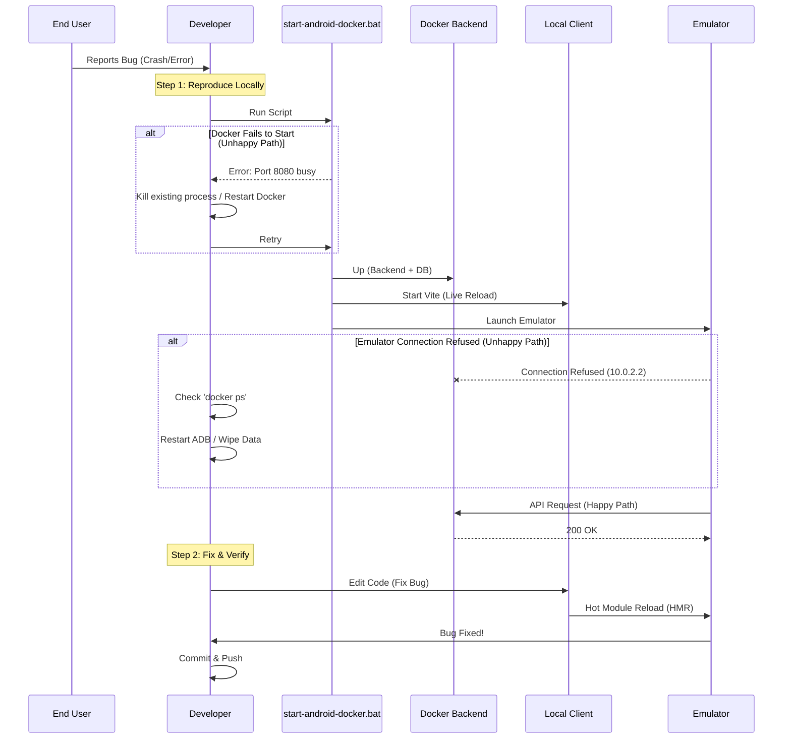
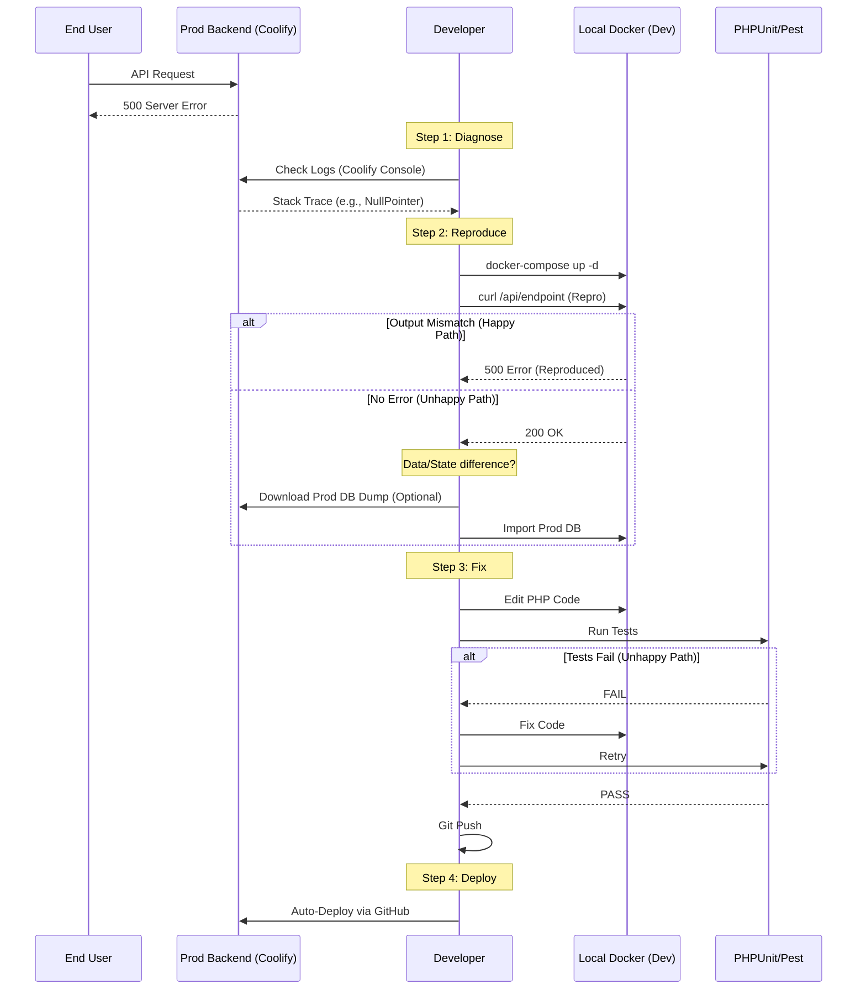
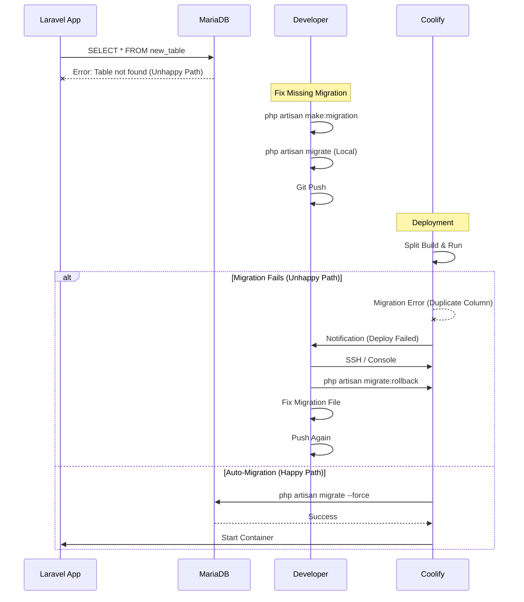
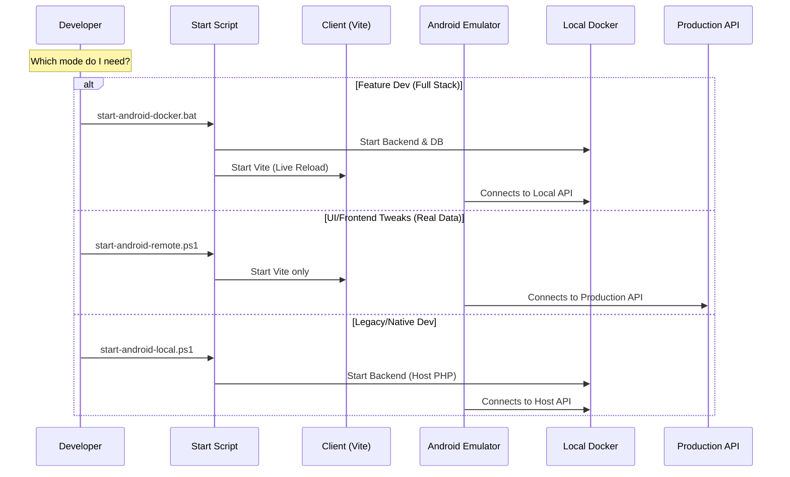
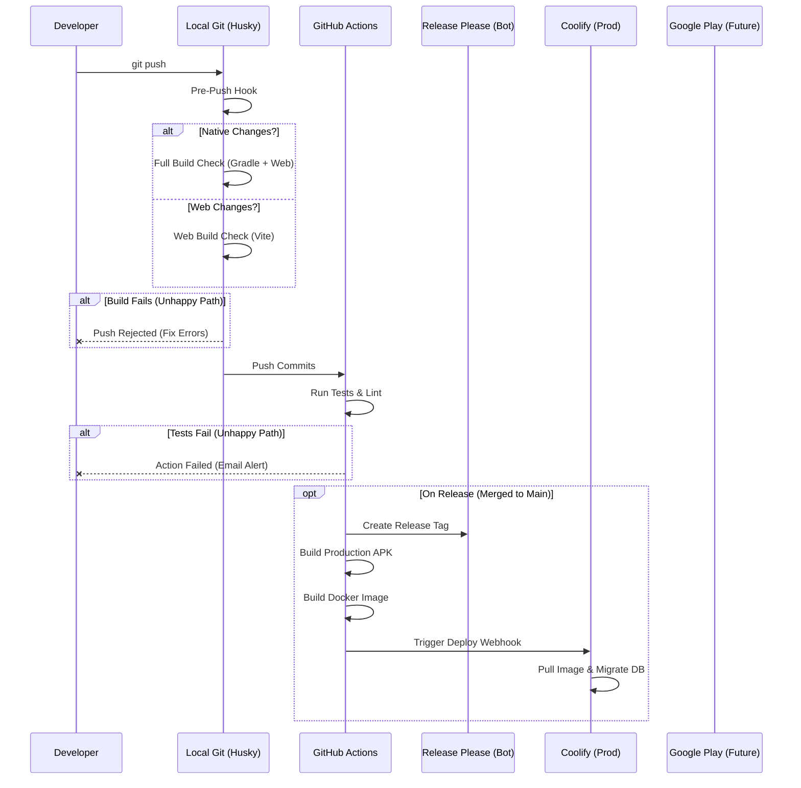

# Cerdas Workflow & Debugging Guide

This document outlines the complete lifecycle of development, from identifying bugs in production to fixing them locally and deploying the solution.

## 1. The "Bug Fix" Loop

How to handle issues reported in production.

### Scenario A: Bug in Production APK (Mobile App)

**Symptom:** User reports "App crashes when I click X" or "Data doesn't load".

### Scenario B: Bug in Production Backend (API/Logic)

**Symptom:** 500 Error, Data Mismatch, "Something went wrong".

### Scenario C: Database Schema / Migration Issues

**Symptom:** `SQLSTATE[HY000]: General error: 1 no such table`.

---

## 2. Development Modes Diagram

Choose the right mode for your task.

## 3. Deployment Pipeline (CI/CD)

What happens when you `git push`.

## 4. Troubleshooting Cheat Sheet

| Problem | Context | Solution |
| :--- | :--- | :--- |
| **Emulator Offline** | Android | Wipe Data in AVD Manager or restart adb server. |
| **"Network Error"** | Client | Check if Backend is running. Check `VITE_API_BASE_URL` in `.env`. |
| **APK connects to localhost** | Production | Ensure `capacitor.config.ts` uses `process.env.CAPACITOR_LIVE_RELOAD`. |
| **Migration Failed** | Coolify | SSH/Console into container: `php artisan migrate --force`. |
| **Push Rejected** | Git | Fix lint errors (`npm run lint`) or build errors (`pnpm build`). |

---

## 5. Environment Management & Build Risks

**Current Risk:**
Our current workflow uses scripts to *modify* `.env` files (e.g., swapping `.env.local-dev` to `.env`).
*   **Danger:** If you run `start-android-local.ps1` (setting API to `localhost`), and then immediately run a manual build (`pnpm build`), you might accidentally build a "Production" APK that points to `localhost`.
*   **Mitigation:** Always use the dedicated GitHub Action for Production builds (which guarantees a clean state).

## 5. Environment Management & Build Variants (Implemented)

We use **Android Product Flavors** to strictly separate environments:

| Flavor | Package ID | Config | Use Case |
| :--- | :--- | :--- | :--- |
| **Dev** | `com.cerdas.client.dev` | Live Reload + Dev API | Local Development |
| **Prod** | `com.cerdas.client` | Bundled Assets + Prod API | Google Play Release |

### How to Build
*   **Local Dev:** `npx cap run android --flavor dev` (runs `assembleDevDebug`)
*   **Production:** Handled by GitHub Actions (`assembleProdRelease`)

**Safety Guarantee:**
It is now Impossible to accidentally overwrite the Production app with a Dev build because they have different Package IDs (`.dev` suffix).
