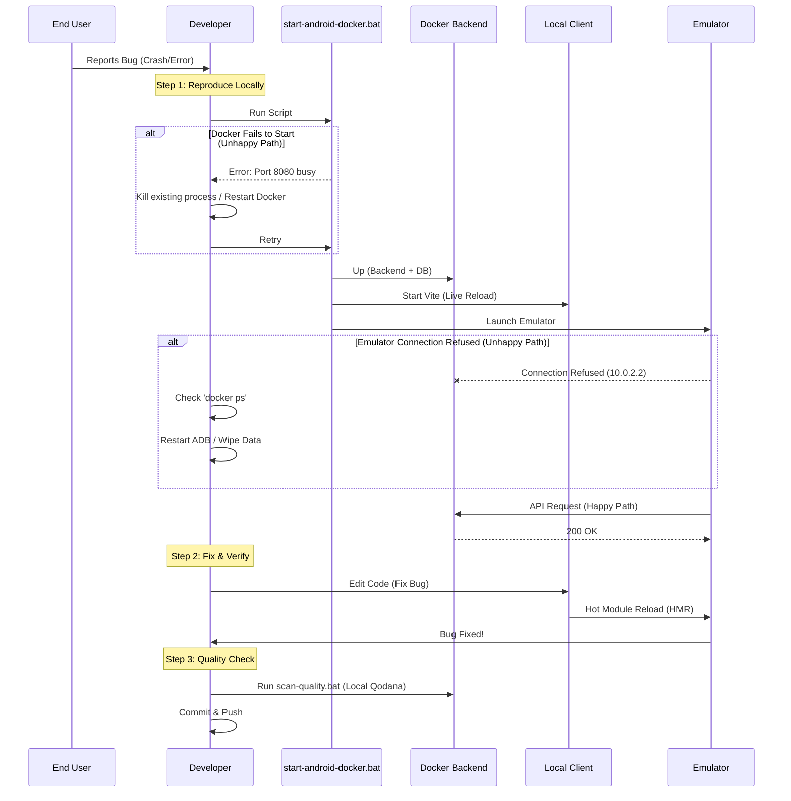
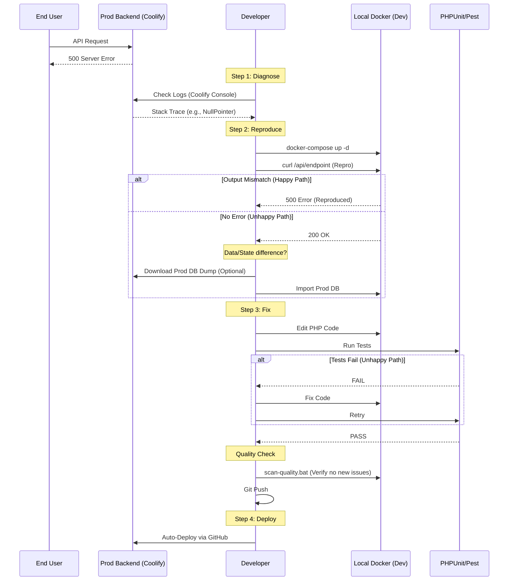
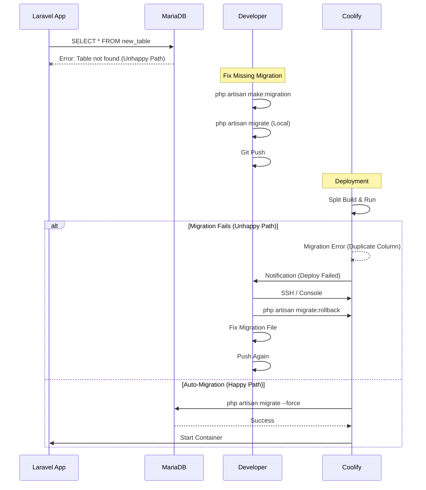
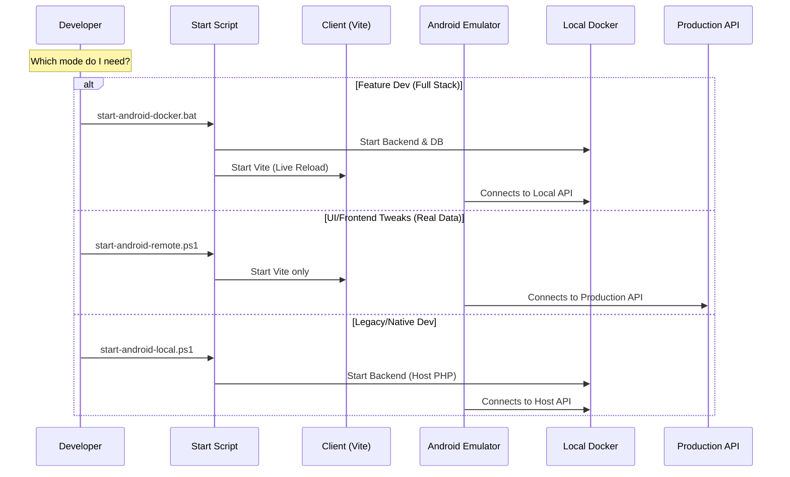
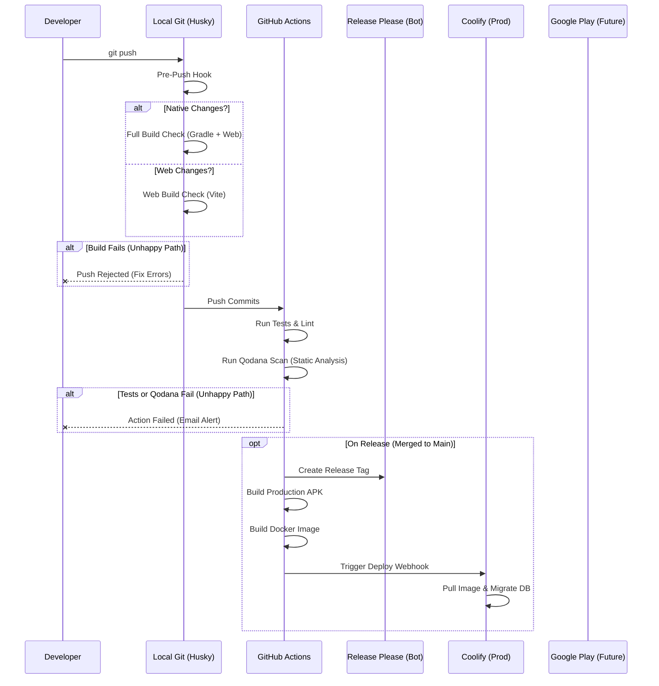

# Cerdas Workflow & Debugging Guide

This document outlines the complete lifecycle of development, from identifying bugs in production to fixing them locally and deploying the solution.

## 1. The "Bug Fix" Loop

How to handle issues reported in production.

### Scenario A: Bug in Production APK (Mobile App)

### Scenario A: Bug in Production APK (Mobile App)

**Symptom:** User reports "App crashes when I click X" or "Data doesn't load".

**🛡️ PRE-FLIGHT CHECK:**
Before deployment, always run:
`audit-deployment.bat`
*   Checks `docker-compose.prod.yml` for common errors (incorrect healthcheck, missing env vars, debug mode).*

**🛡️ PRE-FLIGHT CHECK:**
Before deployment, always run:
`audit-deployment.bat`
*   Checks `docker-compose.prod.yml` for common errors (incorrect healthcheck, missing env vars).*




### Scenario B: Bug in Production Backend (API/Logic)

**Symptom:** 500 Error, Data Mismatch, "Something went wrong".



### Scenario C: Database Schema / Migration Issues

**Symptom:** `SQLSTATE[HY000]: General error: 1 no such table`.



---

## 2. Development Modes Diagram

Choose the right mode for your task.



## 3. Deployment Pipeline (CI/CD)

What happens when you `git push`.



## 4. Troubleshooting Cheat Sheet

| Problem | Context | Solution |
| :--- | :--- | :--- |
| **Emulator Offline** | Android | Wipe Data in AVD Manager or restart adb server. |
| **"Network Error"** | Client | Check if Backend is running. Check `VITE_API_BASE_URL` in `.env`. |
| **APK connects to localhost** | Production | Ensure `capacitor.config.ts` uses `process.env.CAPACITOR_LIVE_RELOAD`. |
| **Migration Failed** | Coolify | SSH/Console into container: `php artisan migrate --force`. |
| **Push Rejected** | Git | Fix lint errors (`npm run lint`) or build errors (`pnpm build`). |
| **502 / Deployment Error** | Prod | **Run `audit-deployment.bat`**. Check for misconfigured Env/Healthcheck. |
| **Editor shows Client App** | Local | **Service Worker Ghosting**. Stop all servers -> Start all -> Use Incognito or Clear Site Data. |
| **Preview App shows Editor UI** | Editor | **Missing `VITE_CLIENT_URL`**. Set `VITE_CLIENT_URL=http://localhost:9981` in `apps/editor/.env`. |
| **API returns stale/wrong data** | Local | **Docker stealing port 8080**. Run `netstat -ano \| findstr :8080` then `tasklist /fi "PID eq <PID>"`. If `com.docker.backend.exe`, see Section 7. |
| **Code changes not reflected** | Backend | **PHP-CGI doesn't auto-reload**. Must run `stop-all.bat` then `start-all.bat` to restart PHP-CGI process. |
| **Laravel Log::info not appearing** | Backend | PHP-CGI serves old bytecode. Restart PHP-CGI (see above). Also check `php artisan route:clear`. |
| **New route returns 404** | Backend | Run `php artisan route:clear` then restart PHP-CGI. Verify with `php artisan route:list --path=<route>`. |

---

## 5. Environment Management & Build Risks

**Current Risk:**
Our current workflow uses scripts to *modify* `.env` files (e.g., swapping `.env.local-dev` to `.env`).
*   **Danger:** If you run `start-android-local.ps1` (setting API to `localhost`), and then immediately run a manual build (`pnpm build`), you might accidentally build a "Production" APK that points to `localhost`.
*   **Mitigation:** Always use the dedicated GitHub Action for Production builds (which guarantees a clean state).
*   **Environment Isolation:** Local `.env` files in `apps/` directories are **git-ignored**. They control your local `pnpm dev` environment but are **NOT** used by GitHub Actions (which uses Secrets). This ensures your local "localhost" settings never leak into Production.

## 5. Environment Management & Build Variants (Implemented)

We use **Android Product Flavors** to strictly separate environments:

| Flavor | Package ID | Config | Use Case |
| :--- | :--- | :--- | :--- |
| **Dev** | `com.cerdas.client.dev` | Live Reload + Dev API | Local Development |
| **Prod** | `com.cerdas.client` | Bundled Assets + Prod API | Google Play Release |

### How to Build
*   **Local Dev:** `npx cap run android --flavor dev` (runs `assembleDevDebug`)
*   **Production:** Handled by GitHub Actions (`assembleProdRelease`)

It is now Impossible to accidentally overwrite the Production app with a Dev build because they have different Package IDs (`.dev` suffix).

## 6. Google Signing & SHA-1 Keys (Critical)

Google Login requires the app's **SHA-1 Fingerprint** to be registered in Google Cloud Console. Since Debug and Release builds use different keys, you need **TWO** entries in the console.


| Environment | Keystore | SHA-1 Source | Console Action |
| :--- | :--- | :--- | :--- |
| **Local Debug** | `debug.keystore` | `keytool -list ... debug.keystore` | Create new Android Client ID with Debug SHA-1. |
| **Production** | Release Keystore (GitHub Secret) | **GitHub Actions Logs** > "Print Code Signing SHA-256" step | Create new Android Client ID with Release SHA-1. |

> [!TIP]
> **How to get Production SHA-1:**
> 1. Go to GitHub Actions tab.
> 2. Click on the latest "Build Android APK" run.
> 3. Expand the **"Print Code Signing SHA-256"** step.
> 4. Copy the `SHA1: ...` fingerprint.
> 5. Add it to Google Cloud Console as a **new** Android Client ID.

> [!IMPORTANT]
> **DO NOT** change `VITE_GOOGLE_CLIENT_ID` in your `.env` files.
> The code always uses the **Web Client ID** (`1335...apps.googleusercontent.com`).
> The Android Client IDs in the console exist *only* to authorize the specific APK signature to talk to Google APIs.

## 7. Port Conflicts: Docker Desktop vs Local Caddy (Critical)

> [!CAUTION]
> **Docker Desktop (`com.docker.backend.exe`) can silently hold port 8080**, even if NO container is actively mapped to that port. This causes the local Caddy server to fail to bind, and ALL API requests go to Docker instead of your local PHP code.

### Symptoms
- API returns data from a **different database** (wrong app names, unknown UUIDs)
- Code changes in `AppController.php` or `routes/api.php` have **NO effect**
- `laravel.log` shows **NO entries** for requests you just made
- `navigation: null` in response even after save appears successful (200 OK)
- `updated_at` timestamp unchanged after PUT request

### Diagnosis

```bash
# Step 1: Check who holds port 8080
netstat -ano | findstr :8080
# Output: TCP 0.0.0.0:8080 ... LISTENING <PID>

# Step 2: Identify the process
tasklist /fi "PID eq <PID>"
# If output is "com.docker.backend.exe" → Docker is stealing the port!
# If output is "caddy.exe" → Local Caddy is correctly serving
```

### Fix

```bash
# Option A: Kill Docker's port claim (safe, Docker containers keep running)
taskkill /F /PID <PID>

# Option B: Stop Docker Desktop entirely
# Right-click Docker tray icon → Quit Docker Desktop

# Then restart local servers
.\stop-all.bat
.\start-all.bat

# Verify Caddy now holds port 8080
netstat -ano | findstr :8080
tasklist /fi "PID eq <NEW_PID>"  # Should be caddy.exe
```

### Prevention
- Always run `netstat -ano | findstr :8080` after `start-all.bat` to verify Caddy owns the port
- If using Docker for MariaDB (port 33066), Docker Desktop does NOT need to expose port 8080
- Consider adding a port check to `start-all.bat`

---

## 8. PHP-CGI Code Reload Behavior

> [!IMPORTANT]
> **PHP-CGI does NOT automatically reload PHP file changes.** After editing backend code (controllers, routes, models), you MUST restart the PHP-CGI process.

### What Gets Cached
| Item | Cached? | How to Clear |
| :--- | :--- | :--- |
| PHP source code (controllers, models) | Yes (PHP-CGI process) | Restart PHP-CGI (`stop-all.bat` + `start-all.bat`) |
| Laravel route cache | Yes (file-based) | `php artisan route:clear` |
| Laravel config cache | Yes (file-based) | `php artisan config:clear` |
| Laravel application cache | Yes (file-based) | `php artisan cache:clear` |
| Blade views | Yes (file-based) | `php artisan view:clear` |

### Quick Reload Sequence
```bash
# Clear all Laravel caches
cd apps\backend
php artisan route:clear && php artisan config:clear && php artisan cache:clear

# Restart servers (required for PHP code changes)
cd ..\..  
.\stop-all.bat
.\start-all.bat
```

### Verifying Code Changes Are Active
```bash
# Check if a route exists
php artisan route:list --path=<route-path>

# Check if code is running (add temporary debug in controller)
# Then check laravel.log after making a request
# Check if code is running (add temporary debug in controller)
# Then check laravel.log after making a request
Get-Content apps\backend\storage\logs\laravel.log -Tail 20
```

---

## 9. Local Code Quality (Qodana)

You can run the same quality checks locally that run in CI/CD. This is useful for catching issues **before** you push.

### Prerequisites
- Docker Desktop must be running.

### How to Run
1.  Run the `scan-quality.bat` script in the root directory.
    ```powershell
    .\scan-quality.bat
    ```
2.  Wait for the scan to complete (first time will download the ~2GB image).
3.  Once finished, it will host a report at `http://localhost:8085`.
4.  Open the link to see:
    -   **Bugs:** Potential null pointers, infinite loops.
    -   **Vulnerabilities:** Security flaws in dependencies.
    -   **Maintainability:** Complex functions, unused code.

### 🛡️ Environment Isolation (Safety)
-   **No Port Conflicts:** We use port **8085** to avoid clashing with your Backend (8080) or Frontend (8000).
-   **Read-Only:** The scan mounts your code as read-only (mostly) and uses a separate `qodana-cache` volume.
-   **Production Safe:** This runs in a verified "Clean Room" container. It **DOES NOT** connect to your local database or production API. It only analyzes the *source text*.

> [!TIP]
> **Faster Scans:** The script uses a Docker volume (`qodana-cache`) to cache results. Subsequent runs will be much faster.


