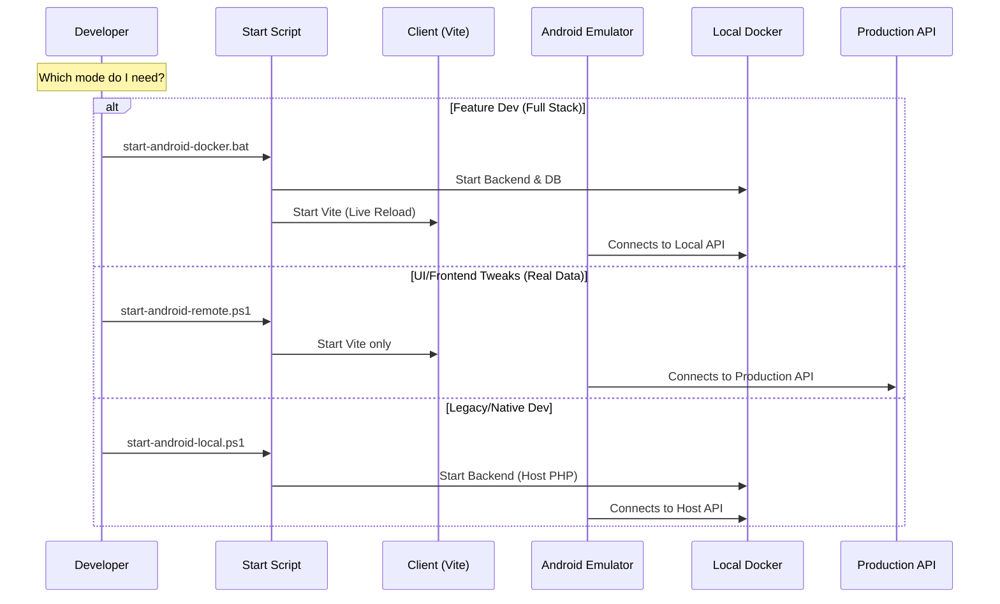
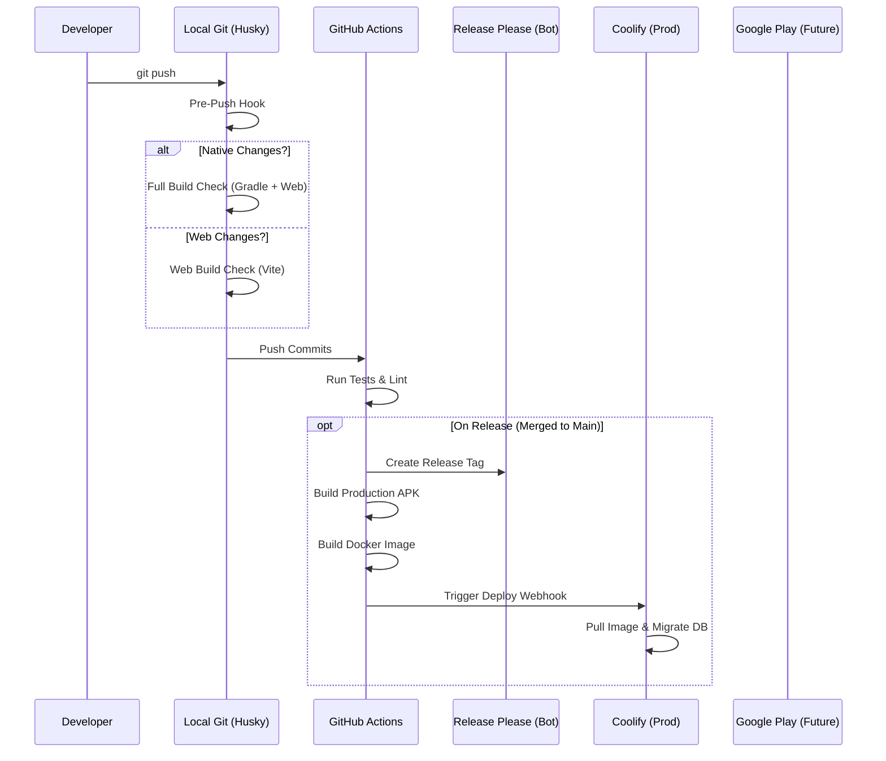

# Cerdas Workflow & Debugging Guide

This document outlines the complete lifecycle of development, from identifying bugs in production to fixing them locally and deploying the solution.

## 1. The "Bug Fix" Loop

How to handle issues reported in production.

### Scenario A: Bug in Production APK (Mobile App)

**Symptom:** User reports "App crashes when I click X" or "Data doesn't load".

1.  **Reproduce Locally (Fastest):**
    *   Run: `start-android-docker.bat`
    *   This uses **Local Docker Backend** + **Local Client**.
    *   If bug reproduces -> **Fix in Client Code**.
    *   *Why?* Most UI/Logic bugs are backend-agnostic.

2.  **Reproduce with Production Data (If Step 1 fails):**
    *   Run: `scripts/start-android-remote.ps1`
    *   This uses **Real Production Backend** + **Local Client**.
    *   *Warning:* You are operating on REAL data. Be careful.
    *   If bug reproduces here but not in Step 1 -> **Backend Data/State Issue**.

3.  **Fix & Verify:**
    *   Apply fix in `apps/client`.
    *   Test in Emulator (Live Reload).
    *   Commit & Push.

### Scenario B: Bug in Production Backend (API/Logic)

**Symptom:** 500 Error, Data Mismatch, "Something went wrong".

1.  **Check Logs (Coolify):**
    *   Open Coolify Console -> Project -> Backend -> Logs.
    *   Find the stack trace (e.g., `Method not found`, `Table missing`).

2.  **Reproduce in Docker:**
    *   Run: `docker-compose -f docker-compose.dev.yml up -d`
    *   Check Backend Logs: `docker logs -f cerdas-backend-1`.
    *   Hit the API endpoint using Postman or `curl`.

3.  **Fix & Verify:**
    *   Modify PHP code in `apps/backend`.
    *   *Note:* Backend code changes in Docker require a container restart OR use `./start-all.bat` for local PHP serving (faster dev loop).
    *   Run Tests: `docker exec -it cerdas-backend-1 php artisan test`.

### Scenario C: Database Schema / Migration Issues

**Symptom:** `SQLSTATE[HY000]: General error: 1 no such table`.

1.  **Local Fix:**
    *   Create migration: `php artisan make:migration fix_missing_column`.
    *   Run locally: `php artisan migrate`.

2.  **Deployment Safety:**
    *   Our `Dockerfile.prod` automatically runs `php artisan migrate --force` on startup.
    *   **Action:** Just `git push`. Coolify will deploy and migrate automatically.

---

## 2. Development Modes Diagram

Choose the right mode for your task.

## 3. Deployment Pipeline (CI/CD)

What happens when you `git push`.

## 4. Troubleshooting Cheat Sheet

| Problem | Context | Solution |
| :--- | :--- | :--- |
| **Emulator Offline** | Android | Wipe Data in AVD Manager or restart adb server. |
| **"Network Error"** | Client | Check if Backend is running. Check `VITE_API_BASE_URL` in `.env`. |
| **APK connects to localhost** | Production | Ensure `capacitor.config.ts` uses `process.env.CAPACITOR_LIVE_RELOAD`. |
| **Migration Failed** | Coolify | SSH/Console into container: `php artisan migrate --force`. |
| **Push Rejected** | Git | Fix lint errors (`npm run lint`) or build errors (`pnpm build`). |
