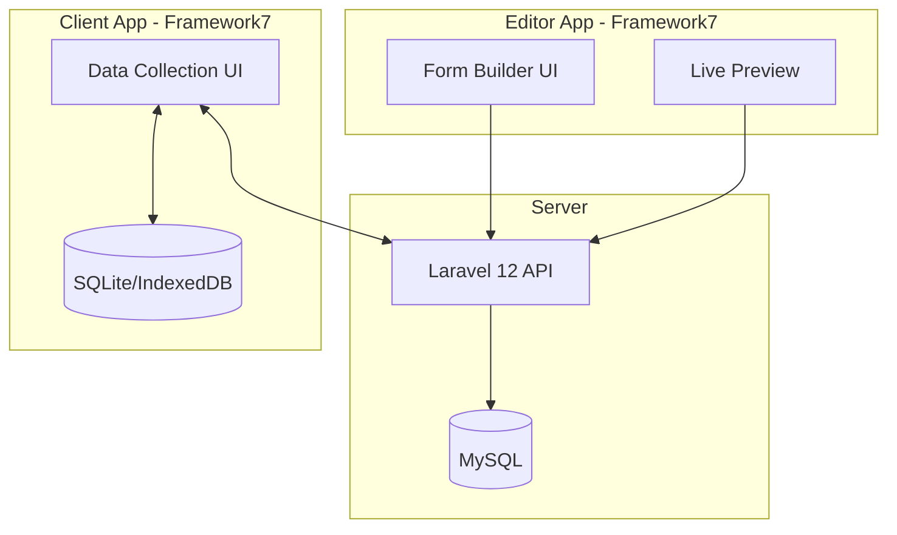
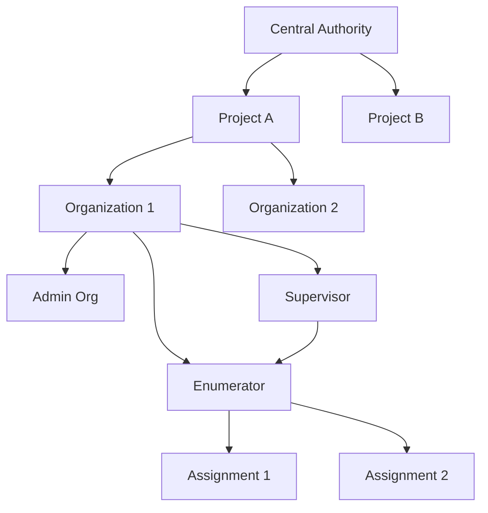
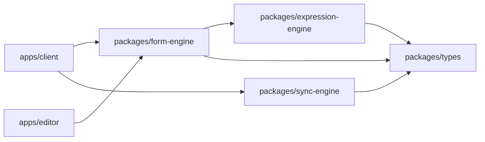
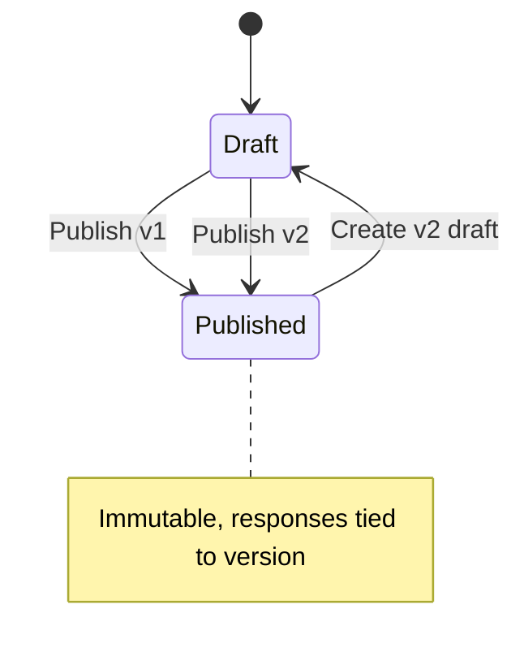

# Cerdas - AppSheet Clone Implementation Plan

> **Project Codename**: Cerdas (Indonesian: "Smart")
> **Goal**: Self-hosted, offline-first, no-code app builder for data collection

> [!NOTE]
> **Reference Document**: Always consult [architecture_principles.md](file:///C:/Users/Admin/.gemini/antigravity/brain/6aa89f4f-fdf3-448d-8799-1234dfbcf31c/architecture_principles.md) before implementation.

---

## Executive Summary

Build an AppSheet-like platform enabling dynamic form creation, offline data collection with sync, and multi-tenant project management. Primary use case: field surveys (e.g., RTLH housing survey with 10,000+ users).

### Technology Stack
| Layer | Technology | Purpose |
|-------|------------|---------|
| **Backend** | Laravel 12 | Pure API only (no Blade, no Filament) |
| **Client App** | Framework7 v9 + Vue 3 + TS | Field data collection (enumerators) |
| **Editor App** | Framework7 v9 + Vue 3 + TS | Form builder (admins) |
| **Offline DB** | capacitor-community/sqlite | IndexedDB (web) / SQLite (native) |
| **Server DB** | MySQL | Multi-tenant shared database |
| **Auth** | Laravel Sanctum | Token-based, self-hosted |

### Key Architectural Decisions
| Decision | Choice | Rationale |
|----------|--------|-----------|
| Validation Engine | JavaScript closures (client-side) | Offline-capable, admin writes JS |
| Sync Strategy | Last-write-wins | Simple conflict resolution for surveys |
| Data Storage | JSON in `responses.data` | Dynamic forms, unknown columns |
| Multi-tenant | Shared DB + `tenant_id` columns | Cost-effective, easier ops |

---

## System Architecture



---

## Multi-Tenant Hierarchy



**Key Rules:**
- 1 Assignment → 1 Organization, 1 Supervisor, 1 Enumerator
- Users can have **different roles** across projects
- Users see only assignments related to them in each project

---

## Monorepo Structure

```
cerdas/
├── apps/
│   ├── backend/              # Laravel 12 (Pure API)
│   │   ├── app/
│   │   │   ├── Http/Controllers/Api/
│   │   │   ├── Models/
│   │   │   └── Services/
│   │   ├── database/migrations/
│   │   └── routes/api.php
│   │
│   ├── client/               # Framework7 + Vue 3 (Data Collection)
│   │   ├── src/
│   │   │   ├── app/          # Feature modules
│   │   │   │   ├── auth/
│   │   │   │   ├── forms/
│   │   │   │   └── sync/
│   │   │   ├── common/
│   │   │   └── main.ts
│   │   └── capacitor.config.ts
│   │
│   └── editor/               # Framework7 + Vue 3 (Form Builder)
│       └── src/
│           ├── app/
│           │   ├── projects/
│           │   ├── schemas/
│           │   └── preview/
│           └── common/
│
├── packages/
│   ├── types/                # @cerdas/types - Shared TS interfaces
│   ├── form-engine/          # @cerdas/form-engine - Form renderer
│   ├── expression-engine/    # @cerdas/expression-engine - JS closures
│   └── sync-engine/          # @cerdas/sync-engine - Offline sync
│
│   # Note: UI components are per-app, not shared
│   # apps/client/src/components/ and apps/editor/src/components/
│
├── turbo.json
├── pnpm-workspace.yaml
└── package.json
```

### Package Dependencies


> [!NOTE]
> UI components are **per-app** for flexibility. Client and Editor have different UI needs.

---

## Database Schema (Core Tables)

### Multi-Tenant & Auth

```sql
-- Central authorities and project-level admins
users (id, name, email, password, is_super_admin, ...)

-- Projects created by central authority
projects (id, name, slug, description, created_by, ...)

-- Organizations participating in a project
organizations (id, project_id, name, ...)

-- User membership with role per project-organization
project_memberships (
    id, user_id, project_id, organization_id,
    role ENUM('admin', 'supervisor', 'enumerator'),
    supervisor_id NULL, -- for enumerators
    ...
)
```

### Dynamic Schema System (with Versioning)

```sql
-- App definition (form configuration)
app_schemas (
    id, project_id, name, slug,
    current_version INT DEFAULT 1,
    published_at TIMESTAMP NULL, -- NULL = draft
    settings JSON,
    ...
)

-- Schema versions (immutable after publish)
app_schema_versions (
    id, app_schema_id, version INT,
    schema JSON, -- Full form definition snapshot
    changelog TEXT,
    created_at, published_at,
    UNIQUE(app_schema_id, version)
)

-- Field definitions within schema version
fields (
    id, schema_version_id, name, label, type,
    config JSON,
    validation_js TEXT,
    show_if_js TEXT,
    editable_if_js TEXT,
    order, parent_field_id NULL,
    ...
)

-- Lookup/reference definitions
field_lookups (
    id, field_id, 
    source_table, source_column, display_column,
    filter_js TEXT,
    ...
)
```

### Schema Versioning Strategy



**Rules:**
- Published versions are **immutable**
- Responses are tied to `schema_version_id`
- Client syncs specific version, not latest
- Migration path: old responses stay with old version

### Data Storage (EAV-like for flexibility)

```sql
-- Prelist/Assignment master
assignments (
    id, app_schema_id, organization_id,
    supervisor_id, enumerator_id,
    external_id, -- imported ID from Excel
    status ENUM('assigned', 'in_progress', 'completed', 'synced'),
    prelist_data JSON, -- prefilled data from import
    ...
)

-- Collected responses
responses (
    id, assignment_id, 
    parent_response_id NULL, -- for nested forms
    data JSON, -- actual form responses
    local_id, -- client-generated UUID
    synced_at, device_id,
    created_at, updated_at,
    ...
)

-- Sync tracking
sync_logs (
    id, device_id, user_id,
    action ENUM('push', 'pull'),
    records_count, status,
    error_message,
    ...
)
```

---

## Phase 1: Foundation

### 1.1 Monorepo Setup
```bash
# Initialize with pnpm
pnpm init
# Add workspace config
# Setup Turborepo
pnpm add -D turbo
```

**Files to create:**
- `pnpm-workspace.yaml`
- `turbo.json`
- `package.json` (root)
- `.gitignore`
- `.nvmrc` (Node 20 LTS)

### 1.2 Laravel Backend (Pure API)
```bash
cd apps
composer create-project laravel/laravel backend
cd backend
php artisan install:api  # Installs Sanctum
```

**Key Packages:**
- `laravel/sanctum` (API auth - included via install:api)
- `maatwebsite/excel` (prelist import)
- `spatie/laravel-permission` (roles)

> [!NOTE]
> No Filament, no Blade views. Laravel serves only as JSON API.

### 1.3 Core Migrations
Create migrations for:
- `users` (extend default)
- `projects`
- `organizations`
- `project_memberships`
- `app_schemas`
- `fields`
- `assignments`
- `responses`

### 1.4 Framework7 Apps Setup
```bash
# Client app
cd apps
npx create-framework7@latest ./client --vue --typescript --pnpm

# Editor app  
npx create-framework7@latest ./editor --vue --typescript --pnpm
```

---

## Phase 2: Schema Builder

### Dynamic Field Types
| Type | Config Options |
|------|---------------|
| `text` | maxLength, placeholder, pattern |
| `number` | min, max, step, decimal |
| `date` | minDate, maxDate, format |
| `select` | options[], multiple, allowOther |
| `radio` | options[], layout (horizontal/vertical) |
| `checkbox` | options[] |
| `image` | maxSize, compression, camera/gallery |
| `gps` | accuracy, autoCapture |
| `signature` | canvasSize |
| `nested` | childSchemaId, minRows, maxRows |
| `lookup` | sourceTable, displayColumn, filterJs |

### Expression Engine
```typescript
// packages/expression-engine/src/index.ts
interface ExpressionContext {
  row: Record<string, any>;      // Current form data
  parent?: Record<string, any>;  // Parent form data (nested)
  user: { id, role, orgId };
  prelist: Record<string, any>;
}

function evaluateExpression(
  jsCode: string, 
  context: ExpressionContext
): any {
  // Safe eval with sandboxed context
  const fn = new Function('ctx', `with(ctx) { return ${jsCode}; }`);
  return fn(context);
}
```

---

## Phase 3: Client App Foundation

### Initialize Framework7 + Vue
```bash
cd apps/client
npx create-framework7@latest ./ --vue --typescript
npm install @capacitor-community/sqlite
```

### SQLite Schema (Client)
```sql
-- Local schema mirror
CREATE TABLE app_schemas (
    id TEXT PRIMARY KEY,
    project_id TEXT,
    schema TEXT, -- JSON
    version INTEGER,
    synced_at TEXT
);

-- Local assignments
CREATE TABLE assignments (
    id TEXT PRIMARY KEY,
    app_schema_id TEXT,
    prelist_data TEXT, -- JSON
    status TEXT,
    synced_at TEXT
);

-- Local responses (pending sync)
CREATE TABLE responses (
    local_id TEXT PRIMARY KEY,
    server_id TEXT,
    assignment_id TEXT,
    parent_response_id TEXT,
    data TEXT, -- JSON
    is_synced INTEGER DEFAULT 0,
    created_at TEXT,
    updated_at TEXT
);

-- Sync queue
CREATE TABLE sync_queue (
    id INTEGER PRIMARY KEY,
    action TEXT,
    table_name TEXT,
    record_id TEXT,
    payload TEXT,
    attempts INTEGER DEFAULT 0,
    created_at TEXT
);
```

---

## Phase 4: Dynamic Form Renderer

### Component Architecture
```
packages/form-engine/
├── src/
│   ├── components/
│   │   ├── FormRenderer.vue
│   │   ├── FieldRenderer.vue
│   │   └── fields/
│   │       ├── TextField.vue
│   │       ├── NumberField.vue
│   │       ├── SelectField.vue
│   │       ├── ImageField.vue
│   │       ├── GpsField.vue
│   │       └── NestedFormField.vue
│   ├── composables/
│   │   ├── useFormState.ts
│   │   ├── useValidation.ts
│   │   └── useExpressions.ts
│   └── types/
│       └── schema.ts
```

---

## Verification Plan

### Phase 1 Verification
| Test | Type | Command/Steps |
|------|------|---------------|
| Monorepo builds | CI | `pnpm turbo build` |
| Laravel boots | Manual | `cd apps/backend && php artisan serve` → verify 200 |
| API responds | Manual | `curl localhost:8000/api/ping` → JSON response |
| Migrations run | CLI | `php artisan migrate --seed` |
| Client dev server | Manual | `cd apps/client && pnpm dev` → F7 app loads |
| Editor dev server | Manual | `cd apps/editor && pnpm dev` → F7 app loads |

### Phase 3 Verification
| Test | Type | Command/Steps |
|------|------|---------------|
| Client builds | CI | `cd apps/client && pnpm build` |
| SQLite init | Manual | Open PWA → DevTools → IndexedDB → verify tables |
| Offline mode | Manual | DevTools → Network → Offline → app still loads |

### Phase 4 Verification
| Test | Type | Command/Steps |
|------|------|---------------|
| Form renders | Manual | Create test schema → view in client → all fields display |
| Validation works | Manual | Enter invalid data → error shows → submit blocked |
| Nested form | Manual | Add child rows → data saved correctly |

> [!NOTE]
> Detailed unit tests will be defined after Phase 1 setup when we have access to the testing frameworks (PHPUnit for Laravel, Vitest for Vue).

---

## User Review Required

> [!IMPORTANT]
> **Keputusan Arsitektur Kunci yang Perlu Persetujuan:**
> 1. **EAV-like data storage** (JSON di `responses.data`) vs normalized tables per-app
> 2. **Monorepo dengan 3 apps** (backend, client, editor) vs 2 apps (backend+editor combined)
> 3. **Shared packages** (`form-engine`, `expression-engine`) sebagai internal packages

> [!WARNING]
> **Risiko yang Perlu Dipertimbangkan:**
> - JavaScript closure execution di client memiliki security concern (user bisa inject malicious code)
> - JSON data storage kurang optimal untuk query kompleks dibanding normalized tables
> - Multi-tenant dengan shared database memerlukan discipline ketat pada query filtering

---

## Timeline Estimate

| Phase | Duration | Dependencies |
|-------|----------|--------------|
| Phase 1: Foundation | 1-2 weeks | - |
| Phase 2: Schema Builder | 2-3 weeks | Phase 1 |
| Phase 3: Client Foundation | 1-2 weeks | Phase 1 |
| Phase 4: Form Renderer | 2-3 weeks | Phase 2, 3 |
| Phase 5: No-Code Editor | 3-4 weeks | Phase 4 |
| Phase 6: Sync & Data | 2-3 weeks | Phase 4 |
| Phase 7: Polish | 2-3 weeks | Phase 5, 6 |

**Total Estimate**: 13-20 weeks (3-5 months) for MVP
