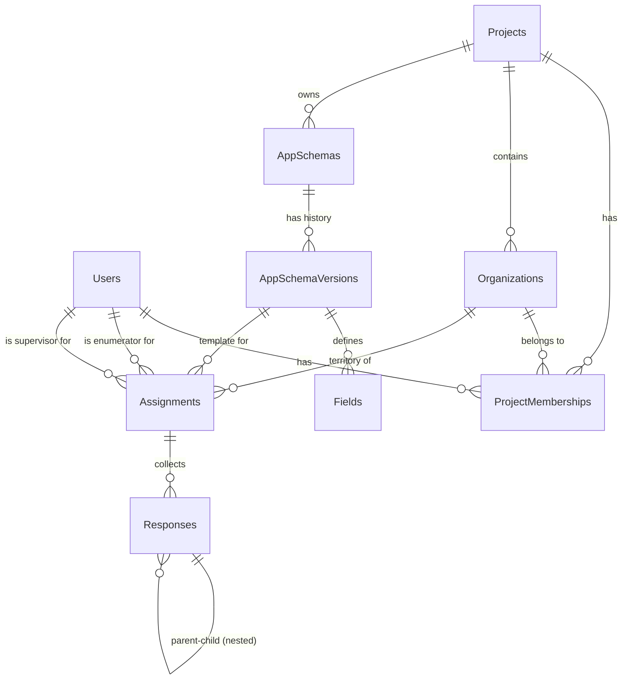
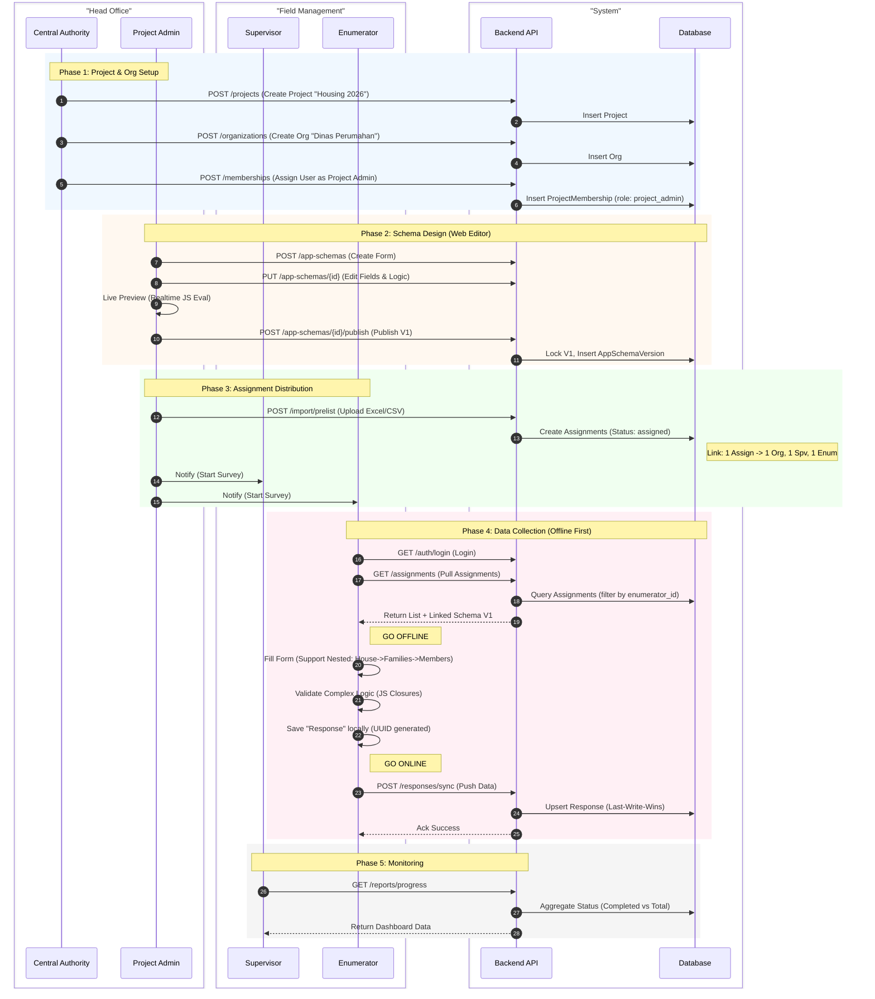
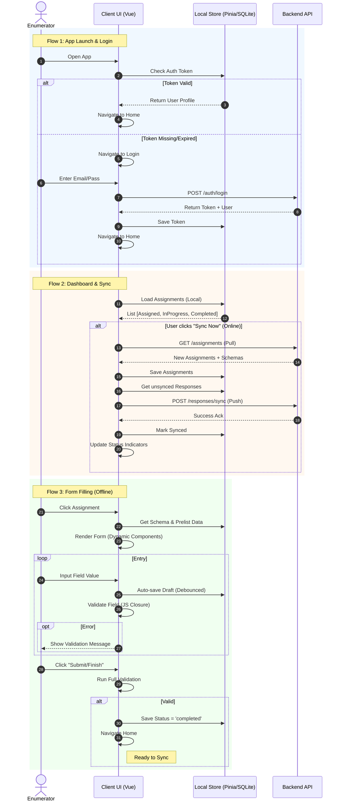

# Cerdas - System Reference & Specification

> **Purpose**: This document serves as the **Single Source of Truth** for system requirements, features, and entity relationships. Use this to validate database design consistency and feature implementation.

## 1. Core Requirements (Kebutuhan Sistem)

### 1.1 Fundamental Capabilities
1.  **Offline-First Architecture**: The Client App (Enumerator) MUST function 100% without internet connection. Data syncs when online.
2.  **No-Code Form Builder**: Admins MUST be able to define complex forms (Schemas) via a web interface without deploying code.
3.  **Multi-Tenancy**: The system MUST support multiple isolated "Projects" (e.g., "Housing 2026", "Agri Census") on a single backend instance.
4.  **Device Agnostic**: The Client App MUST run on Android (APK) and Web (PWA).

### 1.2 Performance & Scalability
1.  **High Volume**: Support 10,000+ users and millions of response rows.
2.  **Optimized Sync**: Sync payloads MUST be minimized (Delta Sync). Large media (images) sync separately.

---

## 2. Features (Fitur Utama)

### 2.1 Authentication & Identiy
-   **Method**: Laravel Sanctum (Bearer Token).
-   **Security**: Minimal session timeout for security, but long-lived tokens for mobile convenience.
-   **User Types**:
    -   **Super Admin**: System-wide control.
    -   **Project Admin**: Manages specific projects.
    -   **Supervisor**: Manages a team of enumerators.
    -   **Enumerator**: Field worker collecting data.

### 2.2 Organization Management
-   **Hierarchy**: Project -> Organization -> Members.
-   **Roles**: Roles are defined *per project* via `project_memberships`. A user can be an Admin in Project A and an Enumerator in Project B.
    -   **Values**: `['project_admin', 'org_admin', 'supervisor', 'enumerator']`.
    -   *Constraint*: A user can have only ONE role per project (`unique(['user_id', 'project_id'])`).

### 2.3 Dynamic Form Engine
-   **Schema Definition**: Forms are stored as JSON structures defined in `AppSchemaVersion` table (`schema` column).
-   **Field Types**: `text`, `number`, `select`, `image` (camera), `gps` (geolocation), `signature`, `nested` (repeater groups).
-   **Logic Engine**: Validation (`validation_js`), Visibility (`show_if_js`), and Editable (`editable_if_js`) logic are stored as **JavaScript Closures** stringified in the DB and executed safely on the Client.

### 2.4 Assignment & Import (Prelist)
-   **Prelist**: Large datasets (Excel/CSV) imported by Admin to generate `Assignments`.
-   **Distribution**: Assignments are linked to specific `AppSchemaVersion` and `Enumerator`.
-   **Status Workflow**: `assigned` -> `in_progress` -> `completed` -> `synced`.
-   **Reference**: `app_schema_version_id` links to the specific form version used for data collection.

### 2.5 Data Synchronization
-   **Direction**:
    -   **Pull**: Client fetches Schemas, Assignments (assigned to them).
    -   **Push**: Client sends Responses (new/updated).
-   **Conflict Resolution**: **Last-Write-Wins**. The latest timestamp from Client or Server overwrites the other. (Chosen for simplicity in field survey context).
-   **Soft Failures**: Individual record failures during sync (e.g., validation error) do NOT block the entire batch.

---

## 3. Entity Relationships (Relasi Antar Entitas)



### 3.1 Key Foreign Key Rules
1.  **`project_memberships`**: Connects `user_id`, `project_id`, and `organization_id`.
    -   *Constraint*: Unique `[user_id, project_id]`. One role per user per project.
2.  **`assignments`**:
    -   `app_schema_version_id`: **CRITICAL**. Links to a specific *immutable* version of the form. Not the parent `app_schema`.
    -   `enumerator_id`: The user performing the survey.
    -   `prelist_data` (JSON): Static data from import (Name, Address) that cannot be changed by enumerator.
3.  **`responses`**:
    -   `assignment_id`: Links data back to the assignment.
    -   `local_id` (UUID): Generated by client to ensure uniqueness before sync.
    -   `data` (JSON): The actual survey answers. EAV-style storage.

---

## 4. Key Workflows & Interaction Flow (Sequence Diagram)

This diagram illustrates the end-to-end flow from Project Creation by Central Authority to Data Collection by Enumerators.



### 4.2 Scalability & Performance Limits

**Current Capacity Estimates**:
-   **Users**: 70,000+ (Supported). Standard MySQL indexing on `users` and `project_memberships` handles this efficiently.
-   **Responses**: 500,000+ (Supported). `responses` table uses JSON for flexibility.
    -   *Read Performance*: Direct filtering on JSON keys will be slow. **Strategy**: Use Generated Columns (MySQL 5.7+) for high-frequency report filters.
    -   *Write Performance (Sync)*: Current `ResponseController` processes records sequentially (O(N)). For extreme loads (>1000 syncs/sec), refactor to `Batch Upsert` or Queue-based processing.

---

## 5. Invariants & Business Rules (Aturan Bisnis)

1.  **Immutable Schema Versions**: Once an `AppSchemaVersion` is published, it **CANNOT** be modified. Any change requires a new Version. This ensures data consistency for existing responses.
2.  **Data Isolation**: Users must **NEVER** see data from Projects they are not members of. API must always filter by `project_memberships`.
3.  **Role Scoping**:
    -   **Enumerators**: Read `Assignments` (assigned to them), Write `Responses`.
    -   **Supervisors**: Read `Assignments` (assigned to their team), Read `Responses`.
4.  **Sync Idempotency**: Sending the same Response payload twice must verify `local_id` and update (if newer) or ignore, never duplicate.

---

## 6. Client App UI Flows (Alur Antarmuka)

Detailed user journey for the Mobile/PWA Client App.



---

## 7. Client Dynamic View Engine (AppSheet Parity)

The client application (`apps/client`) has transitioned from a hardcoded page structure to a **Dynamic View Engine** driven by server-side configuration.

### 7.1 Architecture
*   **Configuration**: Stored in `app_schema_versions.layout` (JSON).
*   **Sync**: Pulled during login/sync and stored locally in SQLite `app_schemas` table.
*   **Routing**:
    *   `/app/:schemaId`: Loads the App Shell with Tab Navigation based on `layout.navigation.primary`.
    *   `/app/:schemaId/view/:viewName/:recordId`: Renders a specific view (Detail, Form) for a specific record.

### 7.2 Core Components
1.  **`AppShell.vue`**: The main container. Reads `layout`, renders the Tab Bar, and instantiates `ViewRenderer` for the active tab.
2.  **`ViewRenderer.vue`**: The central factory component. props: `{ config, data }`. Switch-cases on `config.type` to render:
    *   `DeckView` (`type: deck`): List view with Image/Title/Subtitle.
    *   `MapView` (`type: map`): Geospatial view (Leaflet/Google).
    *   `DetailView` (`type: detail`): Read-only record detail.
    *   `FormView`: Typically handles `edit` actions (integrated via `AssignmentDetail`).
    *   **Performance Note**: `FormRenderer` implements **Progressive Rendering** (Lazy Loading), rendering fields in chunks of 20 to support large schemas (70+ questions) without UI lag.

### 7.3 Data Flow
1.  **Layout**: `DB.app_schemas.layout` -> `AppShell` -> `ViewRenderer` -> `SpecificView`.
2.  **Data**: `DB.assignments` / `DB.responses` -> `AppShell` (filtered) -> `ViewRenderer` -> `SpecificView`.
3.  **Actions**: User Click -> `SpecificView` emits `action` -> `ViewRenderer` handles navigation (e.g., to Detail or Form).

### 7.4 Example Layout JSON
```json
{
  "app_name": "Survey App",
  "navigation": { "primary": ["map_view", "list_view"] },
  "views": {
    "map_view": { "type": "map", "source": "assignments", "options": { "gps_column": "loc" } },
    "list_view": { "type": "deck", "source": "assignments", "options": { "action": "view_detail" } },
    "view_detail": { "type": "detail", "source": "assignments", "options": { "actions": ["edit"] } }
  }
}
```

---

## 8. Key Decisions & Rationales (Tanya Jawab Awal)

**Q: Why separate `AppSchemaVersion` from `AppSchema`?**
A: Surveys change over time. Old responses must remain valid against the *exact* schema version used during collection. Changing a question in V2 should not break V1 responses.

**Q: Why JavaScript closures for validation?**
A: We need complex validation (e.g., "Age > 18 if Married") to run **Offline**. Backend Languages (PHP) can't run on the client. JS can run on both.

**Q: Why Shared Database for Multi-tenancy?**
A: Simplicity and cost. A single database with `project_id` columns is easier to maintain and cheaper to host than spinning up a new DB for every project.

**Q: Why Last-Write-Wins for Sync?**
A: Real-time collaborative editing is NOT the goal. Field surveys are generally single-user (one enumerator per assignment). LWW is robust enough for occasional conflict resolution without complex merging UIs.
