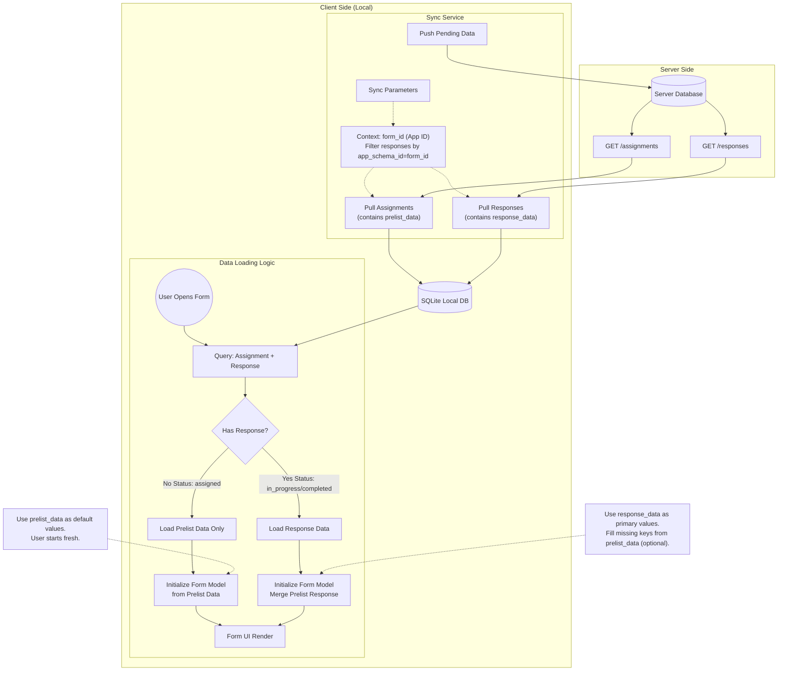

# Cerdas Client Sync & Data Context Flow

## Penjelasan Alur

### 1. Sync Context (Parameterisasi)
Agar data yang diambil sesuai dengan aplikasi yang sedang dibuka, parameter context sangat penting saat melakukan permintaan ke server (API).
*   **Assignments**: Menggunakan filter `form_id` (atau `app_schema_id`). Ini memastikan kita hanya mengambil tugas untuk aplikasi tersebut.
*   **Responses**: Sangat penting untuk juga memfilter `responses` berdasarkan `app_schema_id`. Jika tidak, kita mungkin menarik ribuan jawaban dari aplikasi lain yang tidak relevan, yang memperlambat sync dan memenuhi memori.

### 2. Pengutamaan Data (Priority Strategy)
Saat form dibuka (`FormView`), aplikasi harus menentukan data apa yang ditampilkan ke pengguna.

*   **Assignments Table**: Menyimpan `prelist_data`. Ini adalah data referensi statis dari server (misal: Nama, Alamat, NIK target). Data ini biasanya *tidak berubah* kecuali di-update admin.
*   **Responses Table**: Menyimpan `response_data`. Ini adalah *jawaban* yang diinput oleh enumerator (user).

**Logika Penggabungan (Merge Strategy):**
1.  **Cek Ketersediaan Response**: Query join `assignments` dan `responses` berdasarkan `assignment_id`.
2.  **Skenario A (Belum pernah dikerjakan / Status `assigned`)**:
    *   `response_data` adalah `NULL`.
    *   **Aksi**: Form diinisialisasi menggunakan `prelist_data`. Field form yang memiliki "name" sama dengan key di prelist akan otomatis terisi.
3.  **Skenario B (Sudah ada jawaban / Status `in_progress` atau `completed`)**:
    *   `response_data` tersedia (JSON).
    *   **Aksi**: Form diinisialisasi utamanya menggunakan `response_data`.
    *   *Opsional*: Jika ada field di form yang kosong di `response_data` tapi ada di `prelist_data`, aplikasi bisa melakukan fallback ke nilai prelist (Deep Merge), tapi *best practice*-nya adalah `response_data` dianggap sebagai *current state of truth*.

### 3. Status Response
*   **Synced (is_synced = 1)**: Data jawaban berasal dari server (hasil pull). Jika user mengedit ini, status berubah menjadi unsynced.
*   **Local Draft (is_synced = 0)**: Data jawaban baru disimpan lokal dan belum naik ke server. Data ini memiliki prioritas tertinggi dibanding data server saat ditampilkan.
